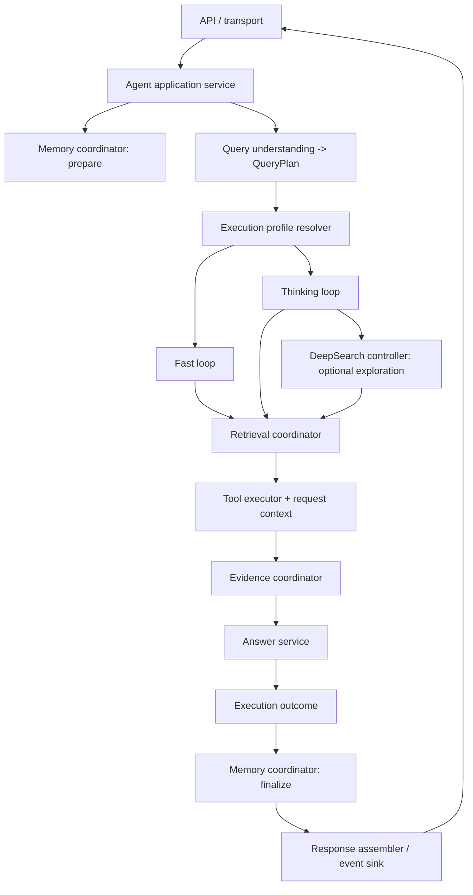

# Agent Layer Architecture

## Scope and invariants

The Agent layer owns query understanding and orchestration of retrieval, tools,
evidence, answer generation, and request-local views of trusted Memory. It does not
own durable Memory storage, browser transport, or retrieval backends.

- Web is the trust boundary for user identity, attachment access, and persistent
  Memory. The Agent accepts those scopes only through authenticated internal
  request contracts.
- Retrieval goes through the Tool Layer registry and executor. Agent code does
  not connect to Milvus, BM25, or embedding services directly.
- Public `ChatResponse` and trusted internal Memory DTOs remain separate.
- Unrelated Web-layer working-tree changes are outside this architecture scope.

## Current execution shape

`Agent.chat()` is the sole supported application execution entry. It owns the
request boundary and delegates each turn through `AgentOrchestrator`, which
prepares trusted Memory and selects the Fast or Thinking profile. `AgentRunner`
is the internal implementation and focused-test seam for Thinking; callers
must not use it as a second application entrypoint.

```text
app.py
  -> API routes
    -> Agent.chat()
      -> AgentOrchestrator.run()
        -> Memory preflight / QueryPlan / policy
        -> ExecutionProfileResolver
          -> FastLoop (simple chat/help or Direct enterprise QA)
          -> AgentRunner (Thinking tool-selection/navigation loop)
            -> ToolExecutor / EvidenceGate / retrieval correction / answer
      -> response mapping / citation validation
```

`ExecutionProfileResolver` now resolves `weight_mode` once after query and
source policy. The supported modes are `auto`, `fast`, and `thinking`.
When omitted, the mode defaults to `fast`. `thinking` selects the existing
Thinking runner. `auto` currently selects the Fast strategy first, subject to
the same eligibility safety check as `fast`;
unsupported requests fall back to Thinking with an internal reason. Initial Fast
eligibility is intentionally narrow: casual/system-help requests with no
retrieval, or single-target enterprise `KNOWLEDGE_QA` using `search_documents`.
Fast performs deterministic Direct retrieval, applies the shared `EvidenceGate`
and at most one corrective retrieval, then generates one answer. It never
selects tools, calls Wiki, or performs DeepSearch. Both paths return
`AgentRunResult` and use the shared answer-model router; Thinking explicitly
selects the complex answer model.

Fast and Thinking share a small `RuntimeSupport` contract for initial message
construction, run-result assembly, insufficient-evidence text, and answer
completeness checks. `FastLoop` depends on this shared component and
`AnswerGenerator`, not on `AgentRunner`. The Runner retains ownership of the
Thinking tool-call state machine, Wiki sequencing, and their budgets.

The public and internal streaming endpoints adapt the canonical `ChatResponse`
through the shared SSE adapter. The current SSE endpoint chunks a completed
answer; it is not live model-token streaming.

DeepSearch decisions now pass through `ExplorationController` inside Thinking.
The model first selects Direct retrieval; only EvidenceGate-accepted results
reach `CoverageAssessor`. `auto` starts Wiki only for a complex query with a
coverage gap, `force` starts it after accepted Direct evidence, and `off` never
starts it. `AgentRunner` still owns the bounded Wiki sequence, tool execution,
and exploration budget; the controller owns only the start decision.
`QueryPlan.navigation_mode` describes retrieval navigation;
`ExecutionProfile.exploration_mode` controls cross-document Wiki exploration.
Fast resolves exploration to `off`; Thinking retains the request setting.

`MemoryCoordinator` is the sole owner of turn-level Memory preparation. It
accepts only the authenticated persistent-Memory DTO supplied by the Web/BFF,
resolves it through `ContextResolver`, applies explicit Fact recall policy, and
returns one `MemoryView` consumed by Query Understanding and either runtime
loop. The Agent does not cache, persist, restore, or clear conversation history
by `session_id`; callers provide any required history explicitly on each turn.
Persistent storage remains outside the Agent Memory module.

Request preparation and tool-context setup/cleanup belong to the orchestrator.
Wiki personal scope is now held in a per-tool `ContextVar`; a concurrency test
proves overlapping personal requests cannot exchange owner/KB scope, and the
ToolExecutor's existing `copy_context()` carries that scope to worker threads.
Invalid signatures remain fail-closed. `last_*` compatibility diagnostics use
request-context-local values and are not inputs to response assembly, audit
classification, or citation logging. A future explicit `ToolExecutionContext`
could replace the remaining setter-based boundary.

## Target architecture



### Ownership boundaries

| Component | Owns | Must not own |
| --- | --- | --- |
| API / transport | Authentication, request validation, JSON/SSE framing | Agent loop or tool policy |
| Agent application service | One-turn lifecycle, trace and request context, component sequencing | Tool execution details or HTTP formatting |
| Memory coordinator | Trusted request-local persistent Memory projection and explicit Fact recall | Durable storage, session-ID history |
| Query understanding | `query + history -> QueryPlan` | Tool execution or transport mode |
| Execution profile resolver | Normalize legacy mode flags and derive budgets/model policy | Retrieval implementation |
| Fast loop | Bounded retrieval/evidence/answer path with no iterative tool planning | Bypassing permissions, evidence, citation, or memory hooks |
| Thinking loop | The bounded tool-call state machine, Wiki step sequencing, budgets, and stop reasons | HTTP/SSE and persistent Memory |
| DeepSearch controller | Coverage decision after accepted Direct evidence; whether Wiki may start | Tool execution, Wiki sequencing, or final answer generation |
| Retrieval / evidence coordinators | Shared retrieval contract, typed evidence, evidence acceptance | User authentication or persistence |
| Tool executor | Sole tool trust boundary; explicit request-scoped authorization context | Shared mutable per-request state |
| Response assembler / event sink | Map one execution outcome to stable JSON or SSE events | Re-executing business logic |

Dependencies point inward and downward:

```text
transport -> application/orchestration -> query, memory, profile
           -> execution strategies -> retrieval, evidence, tools, LLM adapters
```

Memory and transport do not depend on runtime internals. DeepSearch depends on
retrieval/evidence contracts and never calls private `AgentRunner` helpers.
Tools receive authorization and source scope through an explicit request
context rather than shared setters where that migration is complete.

## Shared turn contracts

- `ChatCommand`: validated query, actor/session identity, source selection, and
  requested execution modes.
- `RequestContext`: trace ID, trusted permission filters, attachment allowlist,
  personal-library scope, and navigation scope.
- `MemoryView`: model history, optional persistent context artifact, and
  optional handled recall.
- `QueryPlan`: the existing immutable query-to-execution handoff.
- `ExecutionProfile`: `FAST | THINKING`, exploration `OFF | AUTO | FORCE`,
  bounded tool/retrieval budgets, and answer model policy.
- `ExecutionState`: plan, typed request-local evidence, tool-call records,
  coverage, budgets, and stop reason.
- `ExecutionOutcome`: answer, evidence, diagnostics, stop reason, and
  `MemoryDecision`.
- `RunEvent`: optional reasoning/tool/citation/token/done events projected from
  the same execution outcome; it must not define a second business loop.

## Migration sequence

1. **Unify execution and transport** — completed: all JSON and
   SSE paths call `Agent.chat()`; the shared adapter emits citations, bounded
   answer chunks, and one done/error event.
2. **Make one turn request-local** — keep response mapping and audit decisions
   bound to the current orchestration result; centralize request preparation;
   then migrate tool authorization context to an explicit per-request contract
   across the Agent and Toolset boundaries.
3. **Define execution profiles** — completed first slice: resolve
   `FAST | THINKING` once after query/source policy, retain `AgentRunner` as
   Thinking, and dispatch supported requests to a deterministic Fast loop over
   shared retrieval, authorization, Evidence, citation, and response contracts.
4. **Connect DeepSearch** — completed first slice: invoke the existing
   `CoverageAssessor` through one controller after EvidenceGate accepts Direct
   evidence. `AUTO` explores only for a coverage gap; `FORCE` explores after
   accepted evidence within budget; `OFF` never explores. Wiki sequencing and
   budgets remain owned by Thinking until a separate extraction is justified.
5. **Close Memory ownership** — completed: `MemoryCoordinator` returns one
   request-local `MemoryView`; persistent state remains BFF-owned, and Agent
   session-history caching and database recovery have been removed.
6. **Remove proven redundancy** — completed for producer-only `SubQueryRouter`
   and inert request-field assignments after repository-wide call-site checks.
   Continue splitting runtime responsibilities only after state ownership and
   module contracts are stable.

The Agent API accepts only the current per-Chat modes: `auto`, `fast`, and
`thinking`. A one-time Web database migration copied old Topic mode values to
their Chats, mapping `deeper` to `thinking` and `wider` to `fast`, before
removing the Topic mode column. Runtime Topic reads do not normalize legacy
mode values.

## First-slice acceptance

- `/api/chat`, `/api/chat/stream`, and `/api/internal/chat/retrieval/stream`
  share the same chat execution result.
- Streaming event names and data shapes remain `citations`, `token`, `done`,
  or `error`; joining token chunks reproduces the JSON answer exactly.
- Existing public and internal authentication and response contracts remain
  unchanged.
- No code outside `agent/` is modified for this slice.
