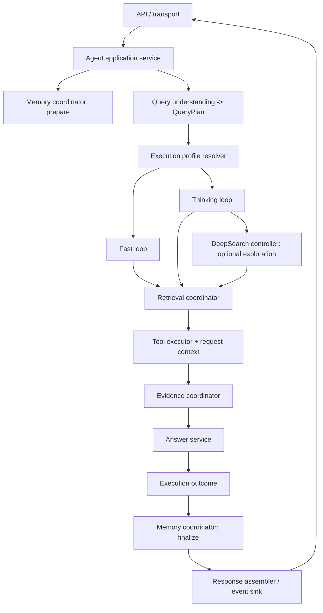

# Agent Layer Architecture

## Scope and invariants

The Agent layer owns query understanding and orchestration of retrieval, tools,
evidence, answer generation, and short-term conversational context. It does not
own durable Memory storage, browser transport, or retrieval backends.

- Web is the trust boundary for user identity, attachment access, and persistent
  Memory. The Agent accepts those scopes only through authenticated internal
  request contracts.
- Retrieval goes through the Tool Layer registry and executor. Agent code does
  not connect to Milvus, BM25, or embedding services directly.
- Public `ChatResponse` and trusted internal Memory DTOs remain separate.
- Unrelated Web-layer working-tree changes are outside this architecture scope.

## Current execution shape

```text
app.py
  -> API routes
    -> Agent.chat()
      -> AgentOrchestrator.run()
        -> Memory preflight / QueryPlan / policy
        -> AgentRunner.run()
          -> ToolExecutor / EvidenceGate / retrieval correction / answer
      -> response mapping / citation validation / short-term write-back
```

Before the shared SSE adapter, the public streaming method also implemented
separate Fast and Thinking loops. Those loops bypassed parts of the
orchestration and runtime pipeline. Public and internal streaming now adapt the
canonical `ChatResponse`; event names and payload shapes are preserved. The
current SSE endpoint is a demo adapter that chunks a completed answer, not live
model-token streaming.

DeepSearch is currently implemented as exploration policy, coverage assessment,
and Wiki navigation across orchestration and runtime code; there is not yet a
single DeepSearch module. Short-term conversation context and BFF-supplied
persistent Memory context are distinct inputs and must remain distinct.

## Target architecture



### Ownership boundaries

| Component | Owns | Must not own |
| --- | --- | --- |
| API / transport | Authentication, request validation, JSON/SSE framing | Agent loop or tool policy |
| Agent application service | One-turn lifecycle, trace and request context, component sequencing | Tool execution details or HTTP formatting |
| Memory coordinator | Short-window history and conversion of trusted Memory input/output | Durable storage access |
| Query understanding | `query + history -> QueryPlan` | Tool execution or transport mode |
| Execution profile resolver | Normalize legacy mode flags and derive budgets/model policy | Retrieval implementation |
| Fast loop | Bounded retrieval/evidence/answer path with no iterative tool planning | Bypassing permissions, evidence, citation, or memory hooks |
| Thinking loop | The single bounded tool-call state machine and stop reasons | HTTP/SSE and persistent Memory |
| DeepSearch controller | Coverage-driven navigation decisions and exploration budgets | Final answer generation or a second loop |
| Retrieval / evidence coordinators | Shared retrieval contract, typed evidence, evidence acceptance | User authentication or persistence |
| Tool executor | Sole tool trust boundary; explicit request-scoped authorization context | Shared mutable per-request state |
| Response assembler / event sink | Map one execution outcome to stable JSON or SSE events | Re-executing business logic |

Dependencies point inward and downward:

```text
transport -> application/orchestration -> query, memory, profile
           -> execution strategies -> retrieval, evidence, tools, LLM adapters
```

Memory and transport do not depend on runtime internals. DeepSearch depends on
retrieval/evidence contracts and never calls private `AgentRunner` helpers.
Tools receive authorization and source scope through an explicit request
context rather than shared setters where that migration is complete.

## Shared turn contracts

- `ChatCommand`: validated query, actor/session identity, source selection, and
  requested execution modes.
- `RequestContext`: trace ID, trusted permission filters, attachment allowlist,
  personal-library scope, and navigation scope.
- `MemoryView`: model history, optional persistent context artifact, and
  optional handled recall.
- `QueryPlan`: the existing immutable query-to-execution handoff.
- `ExecutionProfile`: `FAST | THINKING`, exploration `OFF | AUTO | FORCE`,
  bounded tool/retrieval budgets, and answer model policy.
- `ExecutionState`: plan, typed request-local evidence, tool-call records,
  coverage, budgets, and stop reason.
- `ExecutionOutcome`: answer, evidence, diagnostics, stop reason, and
  `MemoryDecision`.
- `RunEvent`: optional reasoning/tool/citation/token/done events projected from
  the same execution outcome; it must not define a second business loop.

## Migration sequence

1. **Unify execution and transport** — completed in this slice: all JSON and
   SSE paths call `Agent.chat()`; the shared adapter emits citations, bounded
   answer chunks, and one done/error event.
2. **Make Fast and Thinking explicit strategies** — add `ExecutionProfile` and
   a resolver at the application boundary; keep the current runner as the
   Thinking implementation until parity is characterized.
3. **Extract DeepSearch** — give exploration a single controller and resolve
   `navigation_mode` against the real Tool schema and executor contract.
4. **Make tool context request-scoped** — replace shared tool setters/clearers
   with explicit `ToolExecutionContext`; verify concurrent requests cannot
   exchange private source scopes.
5. **Close the Memory lifecycle** — make short-term history purely in-memory;
   keep durable Memory owned by Web/BFF and implement or retire output
   proposals only after call-site evidence.
6. **Split runtime responsibilities** — extract retrieval, evidence, answer,
   and exploration services after state ownership is explicit; then remove
   proven-dead compatibility code through repository-wide call-site checks.

## First-slice acceptance

- `/api/chat`, `/api/chat/stream`, and `/api/internal/chat/retrieval/stream`
  share the same chat execution result.
- Streaming event names and data shapes remain `citations`, `token`, `done`,
  or `error`; joining token chunks reproduces the JSON answer exactly.
- Existing public and internal authentication and response contracts remain
  unchanged.
- No code outside `agent/` is modified for this slice.
