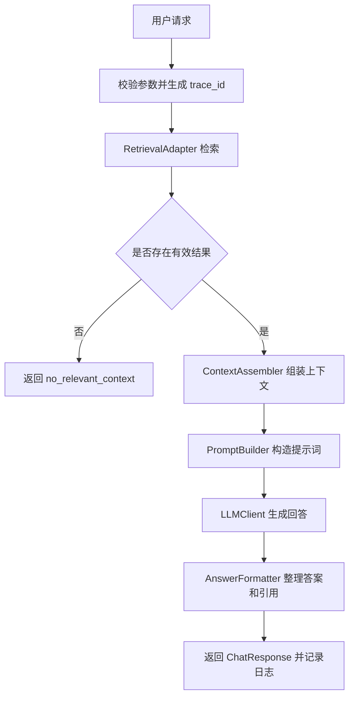
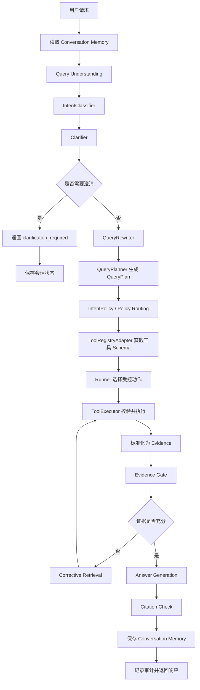

# CP1–CP2 Agent 层核心流程、技术架构与优化计划

## 1. 文档说明

本文档用于统一整理 Agent 层从 CP1 到当前 CP2 的演进情况，内容包括：

- CP1 核心流程、技术架构和功能清单；
- CP2 当前核心流程、技术架构和功能清单；
- CP1 与 CP2 的核心差异；
- CP2 后续优化计划清单。

本文档关注整体流程和架构，不详细展开每个模块的内部实现。各契约与模块细节仍以 `agent/docs/cp1` 和 `agent/docs/cp2` 下的专项文档为准。

---

## 2. 版本演进概览

| 阶段 | 核心形态 | 主要目标 |
|---|---|---|
| CP1 | 单轮 RAG | 检索相关知识，生成有证据和引用的回答 |
| 过渡阶段 | 基础 Agent/Tool Loop | 引入工具注册、工具调用和审计记录 |
| CP2 当前 | 策略驱动、证据约束的 Agent | 理解问题、制定计划、选择策略、执行工具、验证证据并维护短期上下文 |

CP1 的正式基线是固定的单轮 RAG 流程。CP1 与 CP2 之间曾出现 Agent Loop 形式的过渡实现，但实际行为仍接近“一次检索 + 一次生成”。当前 CP2 已经加入明确的 QueryPlan、策略路由、工具调用预算、Evidence Gate、纠正检索和会话记忆。

---

# 第一部分：CP1

## 3. CP1 建设目标

CP1 建立一条稳定、可测试的检索增强生成链路：

> 接收用户问题，检索相关知识，构造模型上下文，生成回答，并返回支持回答的引用。

CP1 的重点是接口稳定、检索层对接、基于证据生成、异常处理和可测试性，而不是自主 Agent 决策。

## 4. CP1 核心流程



核心步骤：

1. 校验用户问题和请求参数。
2. 生成 `trace_id`，用于日志关联和问题排查。
3. 通过 `RetrievalAdapter` 调用检索层。
4. 使用最低相关度阈值过滤检索结果。
5. 没有有效证据时直接返回 `no_relevant_context`，不调用大模型。
6. 将检索文档整理为带编号的上下文。
7. 构造要求基于证据回答的 RAG Prompt。
8. 调用 OpenAI-compatible 模型接口。
9. 整理答案、状态、提示信息和引用编号。
10. 返回统一响应并写入日志。

## 5. CP1 功能架构

```text
API Layer
    ↓
ChatService
    ├── RetrievalAdapter ──→ Tool/Retrieval Layer
    ├── ContextAssembler
    ├── PromptBuilder
    ├── LLMClient ─────────→ Model Service
    └── AnswerFormatter
```

| 层次 | 主要职责 |
|---|---|
| API 层 | 提供健康检查、聊天和演示流式接口 |
| Service 层 | 串联固定 RAG 流程并处理异常 |
| Retrieval Adapter | 隔离 Agent 层与检索工具的实现细节 |
| Context/Prompt | 将检索结果转换成模型输入 |
| LLM Adapter | 提供可替换的大模型调用接口 |
| Formatter | 统一答案、状态、消息和引用格式 |
| Observability | 记录 trace、阶段、状态和错误 |

## 6. CP1 技术架构与技术选型

| 领域 | 技术或设计 | 作用 |
|---|---|---|
| 开发语言 | Python | 后端和 AI 能力的主要实现语言 |
| API 框架 | FastAPI | 快速开发接口并自动生成 OpenAPI 文档 |
| 服务运行 | Uvicorn | 运行 ASGI 应用 |
| 数据契约 | Pydantic | 校验请求、响应和字段类型 |
| 检索对接 | Adapter 模式 | 解耦 Agent 与工具层具体实现 |
| 检索模式 | Vector、BM25、Hybrid | 支持语义、关键词和混合检索 |
| 模型接口 | OpenAI-compatible Chat Completions | 兼容云端或本地模型服务 |
| 测试 | pytest、Mock Retrieval、Mock LLM | 不依赖真实数据库和 API 测试主逻辑 |
| 可观测性 | trace_id、结构化日志 | 请求追踪和故障定位 |
| 工程设计 | 接口抽象、依赖注入 | 提高模块替换能力和可测试性 |

## 7. CP1 功能清单

- 聊天请求参数校验；
- 统一 ChatResponse；
- Health API；
- Retrieval Adapter；
- Vector、BM25、Hybrid 检索模式；
- 检索相关度过滤；
- 上下文组装；
- RAG Prompt 构造；
- OpenAI-compatible 模型调用；
- 答案格式化；
- 引用编号整理；
- 无有效证据时提前结束；
- 检索异常和模型异常处理；
- trace 和日志；
- Mock 单元测试；
- 基础演示流式返回。

## 8. CP1 能力边界

CP1 尚不包含：

- 多轮会话记忆；
- 意图识别；
- 指代解析和查询重写；
- 主动澄清；
- QueryPlan；
- 不同问题对应不同执行策略；
- 受控的多工具调用；
- 按意图评估证据；
- 证据不足后的纠正检索；
- 真正的多步 Agent 决策循环。

因此，CP1 应定位为稳定的单轮 RAG 基线。

---

# 第二部分：CP2 当前实现

## 9. CP2 建设目标

CP2 将 CP1 的固定流程升级为受控 Agent：

> 理解用户请求，生成结构化 QueryPlan，选择意图对应的执行策略，在预算范围内调用工具，评估证据，必要时纠正检索，生成有依据的回答，并保存短期会话上下文。

CP2 的核心原则是“受控自主”：模型可以参与理解、规划、工具选择和回答生成，但必须受到契约、策略、工具白名单、调用预算和 Evidence Gate 的约束。

## 10. CP2 当前核心流程



核心步骤：

1. 根据 `session_id` 读取最近会话消息。
2. 将请求识别为七类意图之一。
3. 判断是否缺少执行所必需的信息。
4. 无法安全继续时返回澄清问题。
5. 将依赖上下文的问题重写为独立问题。
6. 生成包含意图、独立问题、子问题、澄清状态和过滤条件的 QueryPlan。
7. 将意图映射为 IntentPolicy。
8. 只向 Runner 提供 Policy 允许的工具和 Schema。
9. 校验工具调用，并执行强制过滤条件和调用预算。
10. 将工具结果转换成请求级 Evidence。
11. 按当前意图判断证据是否充分。
12. 证据不足时执行有次数限制的纠正检索。
13. 根据 QueryPlan 和通过检查的 Evidence 生成回答。
14. 检查引用、保存上下文并写入审计记录。

## 11. CP2 功能架构

```text
API Layer
    ↓
Agent / AgentOrchestrator
    ├── Conversation Memory
    ├── Query Understanding
    │     ├── IntentClassifier
    │     ├── Clarifier
    │     ├── QueryRewriter
    │     └── QueryPlanner
    ├── QueryPlan Contract
    ├── IntentPolicy Router
    ├── Runner
    ├── ToolRegistryAdapter
    ├── ToolExecutor
    ├── Evidence Gate
    ├── Corrective Retrieval
    ├── Answer Generation
    ├── Citation Checker
    └── Audit Service
```

| 层次 | 主要职责 |
|---|---|
| API 层 | 接收请求并返回稳定的公共响应 |
| 编排层 | 串联记忆、理解、策略、执行和生成 |
| Query Understanding | 将多轮原始输入转换成可执行 QueryPlan |
| Policy 层 | 选择工具、检索方式、预算、证据规则和答案风格 |
| Tool Adapter | 获取注册工具及机器可读 Schema |
| Execution 层 | 执行受限工具调用并阻止非法或重复行为 |
| Evidence 层 | 标准化和评估检索证据 |
| Response 层 | 生成答案并检查引用 |
| Memory/Audit | 保存短期上下文和持久化审计历史 |

## 12. CP2 七类意图与策略

| 意图 | 核心策略 |
|---|---|
| `knowledge_qa` | Hybrid 检索，生成基于事实的简洁回答 |
| `document_search` | 偏向关键词和文档身份匹配 |
| `summarization` | 扩大检索覆盖并生成结构化摘要 |
| `comparison` | 要求比较对象双方都有证据 |
| `casual_chat` | 不检索，直接对话 |
| `system_help` | 不检索知识库，说明系统能力和使用方法 |
| `unsupported` | 停止执行并说明不支持 |

IntentPolicy 可以约束：

- 候选工具；
- 检索模式；
- `top_k`；
- 最大迭代次数；
- 最大工具调用次数；
- 最大检索次数；
- 证据评估策略；
- 证据组装策略；
- 答案风格；
- 是否必须提供引用。

## 13. CP2 技术架构与技术选型

| 领域 | 技术或设计 | 作用 |
|---|---|---|
| API 服务 | FastAPI、Uvicorn、Pydantic | 保持接口和契约稳定 |
| 主流程编排 | 自研 AgentOrchestrator、受限 Runner | 保持执行流程明确、可控、易测试 |
| 规划契约 | 冻结 QueryPlan | 稳定理解层与执行层边界 |
| 策略模型 | IntentPolicy 映射 | 按问题类型选择执行约束 |
| 工具抽象 | ToolRegistry、Adapter、JSON Schema | 避免主流程硬编码具体工具 |
| 工具安全 | ToolExecutor | 校验工具、参数、过滤条件、预算和异常 |
| 证据控制 | Evidence、Evidence Gate | 减少无依据生成并支持纠正检索 |
| 模型接口 | OpenAI-compatible LLMClient | 支持替换云端或本地模型 |
| Prompt 策略 | Zero-shot 结构化 Prompt | 使用任务规则、JSON 输出格式、会话上下文和 Evidence 约束模型，不依赖示例学习 |
| 短期记忆 | 按 session_id 的进程级内存 | 支持当前单进程多轮上下文 |
| 进程内并发 | RLock、防御性复制 | 保护同一进程的会话数据 |
| 审计持久化 | SQLite Chat History | 保存状态、耗时和 trace 信息 |
| 检索组件 | Milvus、BM25、jieba、sentence-transformers | 支持语义、关键词和混合检索 |
| 文档处理 | PyMuPDF、python-docx | 支持 PDF 和 Word 文档处理 |
| 测试 | pytest、Mock 外部依赖 | 独立测试 Agent 逻辑 |

## 14. CP2 当前功能清单

### Query Understanding

- 七类意图识别；
- confidence 字段和安全回退；
- 澄清判断与澄清响应；
- 基于会话上下文的查询重写；
- standalone query；
- sub-queries；
- QueryPlan；
- 请求过滤条件冲突保护。

### Policy 与执行

- 意图策略路由；
- 候选工具白名单；
- 检索模式选择；
- 动态 `top_k` 约束；
- 迭代预算；
- 工具调用预算；
- 检索次数预算；
- 受限 Agent Loop；
- 重复工具调用保护；
- unsupported 提前结束。

### 工具与证据

- 工具注册和发现；
- 工具 Schema 暴露；
- 工具调用参数校验；
- 强制过滤条件保护；
- 请求级工具结果；
- Evidence 标准化；
- 按意图执行 Evidence Gate；
- 有次数限制的 Corrective Retrieval；
- no-relevant-context 处理。

### 回答、记忆和审计

- 基于证据生成回答；
- Citation Check；
- 按 session 隔离的短期上下文记忆；
- 最近消息数量限制；
- 进程内线程安全；
- SQLite 审计历史；
- trace 与耗时记录；
- 统一 ChatResponse。

### API 与测试

- Health API；
- Chat API；
- Chat History API；
- Tool List API；
- 演示流式接口；
- 契约测试；
- CP2 核心模块单元测试；
- 默认不依赖真实数据库和模型 API 的本地测试。

## 15. CP2 当前能力边界

以下能力尚未完全落地或尚未达到生产级：

- Policy 中的 `answer_style`、`assembly_strategy` 尚未完整影响最终 Prompt 和答案格式；
- `sub_queries` 尚未形成完整的首次并行检索流程；
- Citation Check 目前还不是所有场景下的严格出口门禁；
- Conversation Memory 是进程内存，重启后丢失；
- 多 Worker 和多实例之间不能共享当前记忆；
- 待澄清状态和结构化会话状态仍可加强；
- 多个 LLM 阶段目前主要共用同一个模型配置；
- Query Understanding 可能产生多次串行模型调用；
- 模型和工具调用尚未全面异步化；
- 流式接口是在完整答案生成后分块，不是真正的 Token Streaming；
- 生产级鉴权、限流和多用户数据隔离仍需建设。

---

# 第三部分：CP1 与 CP2 对比

## 16. 核心差异

| 维度 | CP1 | CP2 当前 |
|---|---|---|
| 核心形态 | 固定单轮 RAG | 策略驱动的受控 Agent |
| 问题处理 | 直接使用原始问题 | 分类、澄清、重写、规划 |
| 问题类型 | 默认按知识问答处理 | 七类明确意图 |
| 执行策略 | 固定链路 | 按意图选择 Policy 和预算 |
| 工具对接 | 固定检索调用 | Registry、Schema、白名单、Executor |
| 工具调用 | 通常一次检索 | 受预算控制的多步执行 |
| 证据判断 | 相关度阈值 | 按意图执行 Evidence Gate |
| 证据不足 | 返回无相关上下文 | 可以进行纠正检索 |
| 会话上下文 | 无 | 按 session 保存最近消息 |
| 主动澄清 | 无 | 有独立澄清分支 |
| 查询重写 | 无 | 支持独立问题重写 |
| 引用 | 整理引用编号 | 增加 Citation Checker，仍待加强 |
| 安全控制 | 固定代码流程 | Policy、Schema、预算、重复调用保护 |
| 可观测性 | trace 和日志 | trace、日志、耗时、Memory、SQLite 审计 |

## 17. 架构演进总结

```text
CP1
问题 → 检索 → 上下文 → LLM → 引用答案

CP2
记忆 → Query Understanding → QueryPlan → IntentPolicy
     → 受控工具执行 → Evidence Gate
     → 纠正检索 → 回答 → Citation Check → 记忆
```

CP1 解决的是“系统能否稳定地检索并回答”。

CP2 进一步解决“系统能否理解不同请求、选择受控策略、验证证据并维护会话上下文”。

---

# 第四部分：CP2 后续优化计划

## 18. 优化优先级

| 优先级 | 优化方向 | 主要目标 |
|---|---|---|
| P0 | 完成意图策略落地 | 让七类 Policy 真正影响检索、证据组装、Prompt 和答案格式 |
| P0 | 强化证据和引用门禁 | 阻止缺乏证据支持的关键结论离开主流程 |
| P1 | 子问题与并行检索 | 提高复杂问答、比较、总结的覆盖率并降低耗时 |
| P1 | Prompt Chaining 优化 | 按需执行链路，减少不必要的串行 LLM 调用 |
| P1 | 按需 Few-shot Prompting | 提高意图边界、澄清判断和复杂规划的稳定性 |
| P1 | 分阶段模型路由 | 按任务复杂度、延迟和成本选择模型 |
| P1 | 分层记忆系统 | 支持上下文压缩、多 Worker 和持久历史 |
| P2 | 异步化与多用户并发 | 提高吞吐量和部署能力 |
| P2 | 评测与测试回溯 | 衡量质量、证据、引用、延迟和 Token 成本 |
| P2 | 生产级加固 | 完善鉴权、隔离、限流、超时、重试和监控 |

## 19. 意图策略完整落地

- 将 `answer_style` 接入不同意图的 Prompt 和答案格式；
- 将 `assembly_strategy` 接入证据排序、分组和组装；
- `document_search` 返回文档列表和匹配原因；
- `summarization` 返回结构化摘要；
- `comparison` 组织双方证据并输出比较结构；
- `casual_chat`、`system_help` 避免不必要的知识库检索；
- 统一 `unsupported` 的拒绝和引导行为。

## 20. Prompt Chaining 优化

- 为各 Prompt 阶段定义结构化输入输出；
- 根据问题复杂度执行条件式链路；
- 简单问题可将意图识别、澄清判断、重写和规划合并为一次结构化调用；
- 复杂比较或歧义问题保留多阶段 Prompt Chain；
- 为每个节点设置超时、重试、Token 预算和回退策略；
- 记录各阶段使用的模型、耗时、Token 和结果；
- QueryPlan 和 Evidence 始终作为权威状态，避免仅靠自然语言传递中间信息。

### 20.1 从 Zero-shot 到按需 Few-shot

当前 CP2 整体采用 Zero-shot 结构化 Prompting：模型接收任务规则、允许值、JSON 输出格式、会话历史、工具 Schema 或检索 Evidence，但 Prompt 中没有提供完整的“示例输入—标准输出”任务示范。JSON 示例仅用于描述输出结构，不属于真正的 Few-shot。

后续不应将所有节点统一改成 Few-shot，而应根据离线评测结果按需增加少量高质量示例：

- `IntentClassifier`：加入容易混淆的意图边界示例，例如 knowledge QA 与 document search、summarization 与 comparison；
- `Clarifier`：同时加入“必须澄清”和“无需澄清”的对照示例，控制过度澄清；
- `QueryPlanner`：加入 comparison、summarization 和复杂 knowledge QA 的子问题拆分示例；
- Answer Generation：按 `answer_style` 提供简洁问答、文档列表、结构化摘要和比较结果示例；
- `QueryRewriter`：默认继续使用 Zero-shot，仅在真实测试表明改写不稳定时增加示例，避免模型过度改写；
- 根据意图、语言和失败类型动态选择示例，避免把全部示例塞入每次请求；
- 对示例进行版本管理，并测试其对准确率、延迟和 Token 成本的影响；
- 优先使用人工审核的边界样本和历史失败案例，避免使用未经确认的模型生成答案作为标准示例。

Few-shot 是否生效应由评测数据决定。建议比较 Zero-shot 与 Few-shot 在 Intent Accuracy、Clarification Precision、QueryPlan 合法率、回答质量、Token 消耗和 p95 延迟上的差异，再决定各节点是否启用。

## 21. 并行 Workflow 编排

- 当前已具备基础查询拆分能力：`QueryPlanner` 可以生成最多四个 `sub_queries`，比较问题会通过 Evidence Gate 检查各目标的证据覆盖，并在发现缺失目标后触发第二轮 Corrective Retrieval；
- 当前尚未实现完整复杂任务编排：首次检索仍主要使用 `standalone_query`，`sub_queries` 尚未统一进入首轮执行，纠正检索仍按顺序调用，也没有通用子任务依赖图；
- 并行执行彼此独立的 `sub_queries`；
- 工具层支持时，并行执行 Vector 与 BM25 检索；
- 并行调用相互独立的内部知识库、数据库或 API 工具；
- 增加 Evidence 去重、排序融合和 RRF 等结果融合策略；
- 并行结果统一合并后再进入 Evidence Gate；
- 设置最大并发数、超时、取消和部分失败处理；
- 保持有依赖关系的节点串行，例如先澄清再规划、先评估证据再生成答案；
- 当自研 Orchestrator 难以管理复杂分支、状态恢复或长任务时，再评估通用 DAG/Workflow 框架。

### 21.1 复杂任务拆分与执行升级

当前系统已经实现“规划层的有限拆分”，但尚未完成“执行层的完整复杂任务拆分”。后续建议按以下阶段升级：

1. 将 QueryPlan 中已有的 `sub_queries` 接入首次检索，而不是仅在 Evidence Gate 发现缺失证据后用于纠正检索；
2. 为每个子查询建立请求级执行项，记录子任务 ID、查询内容、状态、耗时、Evidence、重试次数和错误；
3. 对互不依赖的子查询执行受并发上限控制的异步并行检索；
4. 对并行结果执行来源保留、去重、分数归一化和 RRF 等排序融合；
5. 将融合后的 Evidence 统一交给按意图配置的 Evidence Gate；
6. 只对缺失目标或证据不足的子任务执行定向 Corrective Retrieval；
7. 为 summarization 增加分块总结与汇总，为 comparison 增加分目标检索、字段提取和比较汇总；
8. 当业务出现明确的前后依赖、长时间任务或人工审批时，再将子任务扩展为包含依赖边、条件分支、Checkpoint 和恢复机制的 DAG。

目标流程：

```text
复杂问题
    ↓
QueryPlanner 生成 sub_queries
    ├── 子任务 A ──→ 检索/工具执行 ─┐
    ├── 子任务 B ──→ 检索/工具执行 ─┼→ 去重与结果融合
    └── 子任务 C ──→ 检索/工具执行 ─┘
                                      ↓
                                 Evidence Gate
                              ┌───────┴────────┐
                         证据充分          证据不足
                            ↓                 ↓
                         生成回答      定向纠正缺失子任务
```

该优化应继续受到 IntentPolicy、最大并发数、工具调用预算、检索次数预算和 Evidence Gate 的共同控制，避免复杂任务拆分演变为不可控的递归执行。

## 22. 分阶段模型路由

后续可增加 `ModelRouter` 或模型配置档案，避免所有阶段固定使用同一个模型。

| 环节 | 推荐模型策略 |
|---|---|
| IntentClassifier | 小型低延迟模型或确定性规则 |
| Clarifier | 小型模型 |
| QueryRewriter | 小型或中型模型 |
| QueryPlanner | 中型模型，复杂问题可升级 |
| Tool Selection | 结构化输出和 Tool Calling 稳定的模型 |
| 普通知识问答 | 中型模型 |
| 复杂比较和长文总结 | 更强模型 |
| 会话摘要压缩 | 低成本小模型 |
| Evidence/Citation 校验 | 优先程序规则，必要时才使用模型 |
| 离线评测 Judge | 独立强模型，不进入在线主链路 |

建议配置：

```text
QUERY_MODEL
PLANNER_MODEL
AGENT_MODEL
ANSWER_MODEL
SUMMARY_MODEL
EVALUATION_MODEL
```

模型路由可综合考虑意图、复杂度、上下文长度、延迟目标、成本预算和回退可用性。模型自报的 `confidence` 在完成真实数据校准前，只用于日志和分析，不应作为唯一的硬路由条件。

## 23. 分层记忆系统

推荐目标架构：

```text
Request-local AgentState
        ↓
Redis 短期会话状态
        ↓
滚动摘要 + 最近原始消息 + 结构化待办状态
        ↓
关系数据库完整聊天历史和审计
        ↓
按业务需要增加向量长期记忆
```

优化清单：

- 本地单进程测试阶段保留当前内存实现；
- 多 Worker 或多实例部署前接入 Redis；
- 增加 TTL 和会话清理；
- 保存最近原始消息和滚动会话摘要；
- 将 pending clarification、已确认约束和任务状态结构化保存；
- 使用关系数据库保存完整聊天历史和审计；
- 只有出现明确的跨会话个性化需求时才增加向量长期记忆；
- 区分 `user_id`、`session_id` 和 `trace_id`；
- 对同一 session 的并发消息增加顺序控制或锁。

## 24. Evidence 与 Citation 优化

- 将 Citation Check 升级为需要证据意图的严格出口门禁；
- 验证每个关键结论能否映射到已接受 Evidence；
- 检查“引用存在但证据不支持结论”的情况；
- 保证来源身份在检索、融合、生成和格式化过程中不丢失；
- 定义证据不完整时的降级回答策略；
- 在离线评测中增加引用准确率、覆盖率和无依据结论比例。

## 25. 检索优化

- 将 QueryPlan 的 `sub_queries` 接入首次检索；
- 对比较和总结问题执行多查询并行检索；
- 增加结果去重和融合；
- 加强带过滤条件的检索；
- 按意图设置不同阈值和 `top_k`；
- 记录检索覆盖率和 Evidence Gate 拒绝原因；
- 保留纠正检索预算，避免无限循环。

## 26. 并发和部署优化

- 将外部模型、检索和数据库调用逐步改为异步 I/O；
- 使用 Redis 共享多 Worker 会话状态；
- 使用数据库连接池和安全事务；
- 保证同一 session 的消息顺序；
- 增加请求超时和取消传播；
- 限制工具和子问题的并发数量；
- 增加用户级和会话级限流；
- 保持 AgentState 和 Evidence 请求级隔离；
- 增加生产鉴权和用户数据隔离。

## 27. 评测与测试回溯框架

- 建立覆盖七类意图的版本化测试集；
- 对比 CP1 和 CP2 的回答质量和证据一致性；
- 统计意图准确率和混淆矩阵；
- 统计澄清准确率和不必要澄清率；
- 统计检索召回率、证据覆盖和纠正检索收益；
- 统计引用正确率和无依据结论；
- 记录模型调用、Token、耗时、工具调用和失败原因；
- 支持按 `trace_id` 回放；
- 对比 Prompt、模型、Policy 和检索版本；
- 本地单元测试继续与真实数据库和 API 解耦；
- 完整项目环境稳定后增加真实服务集成测试。

## 28. 生产级加固

- 身份认证和权限控制；
- 租户及用户数据隔离；
- 限流与配额；
- 超时、重试和熔断；
- 敏感数据处理；
- Prompt Injection 和工具滥用防护；
- 指标、Dashboard 和告警；
- 配置与密钥管理；
- API 兼容和迁移策略；
- 部署回滚与灾难恢复。

---

# 第五部分：建议实施顺序

## 29. 推荐开发顺序

1. 让现有 IntentPolicy 真正影响证据组装、Prompt 和答案格式。
2. 将 Evidence Gate 和 Citation Check 强化为答案出口控制。
3. 将 QueryPlan `sub_queries` 接入并行检索和结果融合。
4. 优化 Prompt Chaining，减少简单请求的不必要串行模型调用。
5. 基于离线失败样本，为意图识别、澄清和复杂规划增加按需 Few-shot 示例。
6. 增加分阶段 Model Router 和模型配置档案。
7. 增加滚动摘要和结构化待澄清状态。
8. 多 Worker 部署前将短期记忆接入 Redis。
9. 异步化模型、工具和持久化调用。
10. 建立 CP1–CP2 评测、回放和回归报告。
11. 完成生产安全、并发和可观测性建设。

## 30. 总结

CP1 建立了稳定的单轮 RAG 基线：

```text
问题 → 检索 → 上下文 → LLM → 引用答案
```

当前 CP2 已经演进为受策略和证据约束的 Agent：

```text
记忆 → Query Understanding → QueryPlan → IntentPolicy
     → 受控工具执行 → Evidence Gate
     → 纠正检索 → 回答 → Citation Check → 记忆
```

CP2 下一阶段的重点不是无边界增加模块，而是完成现有设计：让意图策略真正影响回答行为，使用子问题执行并行检索，优化 Prompt Chaining，基于评测按需加入 Few-shot 示例，为不同阶段选择合适模型，将记忆升级为可共享的分层系统，并建立可以量化效果的评测与回归能力。
