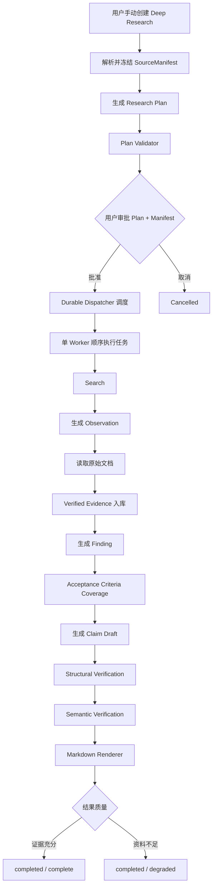

# CP2 Deep Research 本周核心链路执行计划

## 1. 本周目标

根据当前调整，本周不再追求完整 Research Platform，也不提前实现并行、Replan、复杂恢复和扩展 Skill，而是优先完成一条“最短但完整、可信、可持久、可演示”的 Deep Research 纵向链路：



本周结束时，必须能够现场演示：

> 用户手动创建研究任务并选择本地资料；系统冻结研究资料版本，生成 Research Plan；用户明确批准当前 Plan 和 SourceManifest 后，系统持久执行研究任务，通过 Search 找到候选位置、读取原文生成可定位 Evidence，再完成 Finding、Coverage 和 Claim Verification，最终输出带引用的 Markdown Research Report。

本周工作的核心不是节点数量、Agent 数量或者工具数量，而是：

> **先把完整可信的 Deep Research Core Vertical Slice 跑通。**

------

## 2. 当前基础

仓库当前已经具备以下基础，本周直接复用，不重复开发。

### A 已完成

- Chat L0–L2 与 Deep Research 隔离；
- 普通 `/api/chat` 不会自动创建 Research Job；
- `ResearchRequest`、`ResearchPlan`、`ResearchTask` 等 Contract v1；
- 确定性 Plan Validator；
- 合法、非法计划 Fixture；
- Research 和 Chat 的基本边界规则。

### B 已完成

- Agent、LLM、Tool Registry 生命周期复用；
- Chat 性能基线脚本；
- LangGraph + SQLite Checkpoint 技术 Spike；
- Interrupt；
- Approval Resume；
- 进程重启后恢复的技术验证。

### 当前缺失

目前缺少的主要不是单独组件，而是生产级纵向链路：

- Research Job API；
- SQLite Job Repository；
- SourceManifest；
- Planner 生产适配；
- Plan Approval Snapshot；
- Durable Dispatcher；
- Local Research Worker；
- Search → Observation；
- Original Read → Verified Evidence；
- Finding；
- Structured Acceptance Criteria；
- Coverage；
- Claim-first Pipeline；
- Structural / Semantic Verification；
- Markdown Renderer；
- 最小 Restart Recovery；
- 完整 Mock E2E；
- 固定本地文档 E2E。

因此，本周工作的本质是：

> 将现有 Contract、LangGraph Spike 和本地工具能力组装成第一个真正可运行、可信的 Deep Research 产品闭环。

------

# 3. 本周范围控制

## 必须完成

- 手动启动 Deep Research；
- Chat / Research 隔离；
- Research Job 持久化；
- SourceManifest 冻结；
- Planner；
- Plan Validator；
- Plan Version；
- 用户查看并批准 Plan；
- Approval 绑定 `plan_version + manifest_hash`；
- SQLite Repository 作为唯一业务状态真相；
- 最小 Durable Dispatcher；
- 单 Worker 顺序执行；
- Task Dependency 校验与 Topological Sort；
- Local Search；
- 原始文档读取；
- Observation；
- Verified Evidence；
- Finding；
- Structured Acceptance Criteria；
- 基础 Coverage；
- Claim-first 报告链路；
- Structural Verification；
- Semantic Verification；
- Markdown Renderer；
- `completed / complete` 与 `completed / degraded`；
- 最小 Checkpoint；
- 最小 Restart Recovery；
- Mock Full E2E；
- 固定本地 Fixture Full E2E。

## 本周非核心，有时间再做

- Plan Revision；
- 运行中的即时 Cancel；
- `get_document_outline`；
- 复杂 Semantic Verifier；
- 更细粒度用户进度；
- 更多失败场景 Fixture。

Plan Revision 如果未完成，最小审批链允许为：

```text
生成 Plan
    ↓
用户查看
    ↓
Approve / Cancel
```

不影响核心链验收。

## 本周明确不做

- Web Research；
- `web_search`；
- `fetch_url`；
- 双 Worker；
- 并行调度；
- 通用 DAG Scheduler；
- Evidence Gap Replan；
- 多维 Coverage Matrix；
- SSE Replay；
- Redis；
- Celery；
- Kafka；
- Word/PDF 导出；
- Context Compressor；
- 开放式 Supervisor；
- Multi-Agent 平台；
- 通用 Skill Framework；
- 复杂前端页面。

任务依赖只进行：

```text
Validator 检查 Dependencies
        ↓
Topological Sort
        ↓
单 Worker 顺序执行
```

保留未来并行兼容的数据结构，但本周不实现并行 Runtime。

------

# 4. 核心架构约束

## 4.1 SourceManifest 冻结研究资料

用户提交：

```text
SourceScope
```

系统在 Planning 前解析为：

```text
SourceManifest
```

最小结构：

```python
class SourceManifestDocument:
    doc_id: str
    version: str | None
    content_hash: str


class SourceManifest:
    research_id: str
    documents: list[SourceManifestDocument]
    manifest_hash: str
```

规则：

- Manifest 在 Plan 生成前冻结；
- 研究期间不能自动增加新文档；
- Worker 只能访问 Manifest 中的文档；
- Job 重启后继续使用同一 Manifest；
- 文档必须至少具有稳定 `version` 或 `content_hash`；
- Manifest 发生改变时，原 Approval 失效。

用户最终批准的是：

```text
Plan Version
+
Manifest Hash
```

而不是一个可以运行中变化的模糊资料范围。

------

## 4.2 Repository 是唯一业务状态真相

SQLite Repository 保存：

```text
ResearchJob
SourceManifest
ResearchPlan
ResearchTask
Observation
VerifiedEvidence
Finding
Claim
VerificationResult
Report
```

Graph State / Checkpoint 只保存：

```text
current_stage
current_task_id
plan_version
attempt
entity_ids
```

原则：

```text
Repository
= 当前业务状态是什么

Checkpoint
= Workflow 当前执行到哪里
```

禁止同时维护两套完整 Job 状态。

------

## 4.3 Durable Dispatcher

Research Job 不允许只依赖：

```python
asyncio.create_task(run_job())
```

进行触发。

最小流程：

```text
POST /api/research/jobs
        ↓
SQLite 保存 Job
        ↓
立即返回 research_id
        ↓
Durable Dispatcher
        ↓
扫描待处理 Job
        ↓
Claim Job
        ↓
Planner / Research Executor
```

Dispatcher 正常处理：

```text
created
ready
```

服务重启时扫描正在执行但未完成的：

```text
planning
researching
synthesizing
```

然后根据 Repository + Checkpoint：

```text
存在安全恢复点
    ↓
Resume

不存在安全恢复点
    ↓
failed
```

`recoverable` 不作为 Job Status。

Recovery 是 Runtime Policy。

------

## 4.4 Search 与 Evidence 分离

研究链固定为：

```text
Search ToolResult
        ↓
Observation
        ↓
read_document_range
        ↓
Verified Evidence
```

规则：

```text
Search Snippet ≠ Evidence
```

Search 只负责发现候选位置。

只有真正读取原始来源并获得：

- `doc_id`；
- `document_version`；
- `locator`；
- `excerpt`；
- `content_hash`；

之后才能生成 Verified Evidence。

这里的 `Verified` 仅表示：

> 来源、位置和原始文本已经被验证。

不表示现实世界事实真实性已经被外部验证。

------

## 4.5 Structured Acceptance Criteria

每个 ResearchTask 必须拥有结构化 Acceptance Criteria：

```python
class AcceptanceCriterion:
    criterion_id: str
    dimension: str
    target: str
    required: bool
```

示例：

```json
{
  "criterion_id": "C1",
  "dimension": "metric",
  "target": "revenue",
  "required": true
}
```

Finding 显式关联：

```text
covers = ["C1", "C2"]
```

Coverage 本周只计算：

```text
required criterion
→ covered / missing
```

注意：

```text
Finding → Criterion
```

可以包含模型语义判断。

但：

```text
Criterion IDs → Coverage Result
```

必须确定性聚合。

------

## 4.6 Claim-first Reporting

报告生成固定采用：

```text
Finding + Evidence
        ↓
Claim Generator
        ↓
Claim Draft
        ↓
Structural Verification
        ↓
Semantic Verification
        ↓
Verified Claims
        ↓
Markdown Renderer
```

禁止：

```text
自由生成完整报告
↓
事后再抽 Claim
```

Renderer 不负责发现新事实，只负责：

- Markdown 组织；
- 段落；
- 表格；
- Citation；
- Limitations；
- 可读性。

------

# 5. A、B 责任边界

## A：Research Intelligence

A 负责回答：

> 研究应该怎么拆、怎么查、什么时候算覆盖、最终结论是否可信。

主要负责：

- Contract v2 中 Research Semantic Models；
- Planner；
- Plan Validator 业务规则；
- Structured Acceptance Criteria；
- 单 Worker 决策策略；
- Finding；
- Coverage；
- Claim Generator；
- Semantic Verifier；
- Markdown Renderer；
- Mock 和质量 Fixture。

## B：Research Runtime

B 负责回答：

> Research Job 如何创建、冻结资料、持久化、调度、调用工具并稳定跑完。

主要负责：

- Research Job API；
- SQLite Repository；
- SourceManifest Resolver；
- Approval Snapshot；
- Durable Dispatcher；
- LangGraph Runtime；
- Local Tool Adapter；
- Observation Persistence；
- Evidence Ledger；
- Structural Verifier；
- Checkpoint；
- Restart Recovery；
- Cancel 基础能力；
- E2E 基础设施。

## 共同负责

- Contract v2 Review；
- Repository Protocol；
- Planner Input / Output；
- Worker / Tool Interface；
- Finding Schema；
- Claim Schema；
- Verification Schema；
- 固定本地文档 Fixture；
- 每日 Vertical Integration；
- Mock Full E2E；
- Local Fixture Full E2E；
- 最终演示。

------

# 6. A 的本周详细任务

## A1. 扩展 Research Contract v2

在现有 Contract v1 基础上扩展，不无必要地破坏已有字段。

新增核心对象：

```text
SourceManifest
SourceManifestDocument
ResearchApproval
Observation
VerifiedEvidence
Finding
AcceptanceCriterion
CoverageResult
CriterionCoverage
ClaimDraft
VerificationResult
ResearchReport
```

`AcceptanceCriterion`：

```python
class AcceptanceCriterion:
    criterion_id: str
    dimension: str
    target: str
    required: bool
```

`ClaimDraft`：

```python
class ClaimDraft:
    claim_id: str
    claim_text: str
    evidence_ids: list[str]
    criterion_ids: list[str]
```

### DoD

- 所有 Schema 使用严格字段校验；
- 未知字段按现有 Contract Policy 处理；
- Evidence 必须包含稳定 Locator；
- Claim 必须显式绑定 Evidence；
- Finding 必须能够引用 Evidence；
- Finding 可以显式声明覆盖的 Criterion；
- Contract Test 全部通过；
- A/B 不自行重复定义共享 Schema。

------

## A2. 实现最小 Planner

输入：

```text
ResearchRequest
SourceManifest
ResearchBudget
```

输出：

```text
ResearchPlan
├── objective
├── 3～4 个默认 Task
├── dependencies
├── allowed_tools
├── acceptance_criteria
└── max_actions
```

Hard Maximum：

```text
6 Tasks
```

Planner 规则：

- 不修改用户研究目标；
- 不扩大 SourceManifest；
- 不允许 Web Tools；
- 不超过 Task / Action Budget；
- 每个 Task 至少一个 Acceptance Criterion；
- dependencies 必须可被 Validator 验证；
- 最多结构修复两次；
- 两次后仍非法则明确失败。

### DoD

- Mock Planner 稳定生成合法计划；
- Planner 输出经过现有 Validator；
- dependencies 可拓扑排序；
- 不产生 Manifest 外来源；
- 不产生未经允许工具；
- 默认 Demo 不强制拆成 6 个 Task。

------

## A3. 实现单 Worker Research Strategy

每次只处理一个 ResearchTask：

```text
加载 Research Goal
        ↓
加载当前 Task
        ↓
加载 Acceptance Criteria
        ↓
选择 Search Action
        ↓
执行 Search
        ↓
生成 Observation
        ↓
选择 Candidate
        ↓
Read Original Source
        ↓
生成 Verified Evidence
        ↓
生成 Finding
        ↓
检查当前 Task 是否满足停止条件
```

硬规则：

- Search Snippet 只能生成 Observation；
- 未读取原文不得生成 Verified Evidence；
- Worker 不修改 SourceManifest；
- Worker 不修改 Research Objective；
- Worker 不增加预算；
- 达到 Action Limit 后停止；
- 成功任务至少包含一条 Verified Evidence；
- 无 Evidence 时输出缺口，不编造 Finding；
- Worker 不把完整文档写入 Graph State。

### DoD

- 至少跑通一个单文档 Task；
- 至少跑通一个双文档 Research Case；
- 每个成功 Task 至少一次原文读取；
- Finding 可反查 Evidence；
- Evidence 可以反查原始文档位置；
- Worker 不存在无界循环。

------

## A4. 实现基础 Coverage

输入：

```text
AcceptanceCriterion[]
Finding[]
```

Finding：

```text
Finding
├── statement
├── evidence_ids
└── covers[]
```

Coverage：

```text
Criterion
→ covered / missing
```

输出：

```python
class CoverageResult:
    covered: list[str]
    missing: list[str]
    sufficient: bool
```

本周不实现：

- Entity × Dimension Matrix；
- 时间 × 指标 Matrix；
- Evidence Gap Replan；
- Coverage 多轮循环。

### DoD

- Required Criterion 缺失可识别；
- Finding → Criterion 映射明确；
- Criterion → Coverage 聚合确定性执行；
- Missing Criterion 被写入 Limitations；
- Coverage 不充分时不会伪装为完整结果。

------

## A5. 实现 Claim-first 报告链路

链路：

```text
Finding + Evidence
        ↓
Claim Generator
        ↓
ClaimDraft[]
        ↓
Semantic Verification
        ↓
Verified Claims
        ↓
Markdown Renderer
```

Semantic Verifier 支持：

```text
supported
partial
unsupported
conflicting
```

Renderer 只使用：

- Supported Claim；
- 可缩小范围后表达的 Partial Claim；
- Conflicting Claim 的冲突说明；
- Coverage；
- Limitations；
- Evidence Citation。

### DoD

- 每个事实 Claim 至少绑定一条 Evidence；
- Unsupported Claim 不进入确定性正文；
- Partial Claim 不得原样夸大进入正文；
- Conflicting Claim 显式展示冲突；
- Renderer 无 Search / Read Tool；
- Renderer 不创建新 Evidence；
- Renderer 不创建新的事实 Claim；
- 最终报告事实可反查 Evidence。

------

## A6. 建立最小质量 Fixture

至少准备 4 个固定 Case：

### Case 1：单文档事实提取

验证：

- Search；
- Read；
- Evidence；
- Claim；
- Citation。

### Case 2：双文档比较

验证：

- 多个 Task；
- 多文档；
- Dependencies；
- Coverage；
- Comparison Claim。

### Case 3：资料不足

预期：

```text
status = completed
result_status = degraded
```

报告明确说明缺失资料。

### Case 4：证据冲突

预期：

```text
Verification = conflicting
```

报告不得任意选择一边作为确定结论。

每个 Case 至少包含：

- ResearchRequest；
- SourceManifest Fixture；
- Planner Fixture；
- 关键 Evidence；
- Coverage Expected Result；
- Claim Expected Status。

------

# 7. B 的本周详细任务

## B1. 实现 SQLite Job Repository

Repository 是唯一业务状态真相。

保存：

```text
ResearchJob
SourceManifest
ResearchPlan
ResearchTask
Observation
VerifiedEvidence
Finding
Claim
VerificationResult
Report
```

Job Execution Status：

```text
created
planning
awaiting_approval
ready
researching
synthesizing
completed
failed
cancelled
```

Result Status：

```text
complete
degraded
```

失败通过：

```text
status = failed
failure_stage
error_code
```

表示。

### DoD

- Repository 支持 Job 创建、读取和状态更新；
- Manifest、Plan、Task 可重启恢复；
- Graph State 不保存完整业务对象；
- `status` 与 `result_status` 分离；
- 不存在 `recoverable` Job Status；
- Repository 可支持 E2E 独立查询。

------

## B2. 实现核心 API

本周 Core API：

```text
POST /api/research/jobs

GET  /api/research/jobs/{research_id}

GET  /api/research/jobs/{research_id}/plan

POST /api/research/jobs/{research_id}/approve

POST /api/research/jobs/{research_id}/cancel

GET  /api/research/jobs/{research_id}/report
```

Plan Revision：

```text
POST /api/research/jobs/{research_id}/plan/revise
```

属于 P1，有时间再完成。

关键规则：

- 创建 Job 立即返回 `research_id`；
- 用户身份来自服务端 Auth Context；
- `/api/chat` 不调用 Research Job Service；
- 未审批不能进入 Research；
- Approval 必须携带 `plan_version` 与 `manifest_hash`；
- 旧 Plan Version 拒绝；
- 错误 Manifest Hash 拒绝。

------

## B3. 实现 SourceManifest Resolver

创建 Job 后：

```text
SourceScope
    ↓
权限检查
    ↓
解析文档
    ↓
固定版本 / Content Hash
    ↓
SourceManifest
    ↓
Repository
```

Manifest 最小文档项：

```python
class SourceManifestDocument:
    doc_id: str
    version: str | None
    content_hash: str
```

### DoD

- Manifest 在 Planner 前生成；
- Manifest 在审批后不可原地变化；
- Planner / Worker 只能访问 Manifest 文档；
- Job 恢复使用原 Manifest；
- 越权文档无法进入 Manifest；
- 不存在的文档无法进入 Manifest；
- Manifest 有稳定 `manifest_hash`。

------

## B4. 实现 Approval Snapshot

Approval：

```python
class ResearchApproval:
    research_id: str
    plan_version: int
    manifest_hash: str
    approved_by: str
    approved_at: datetime
```

执行前必须重新检查：

```text
Approved Plan Version
==
Current Plan Version
```

以及：

```text
Approved Manifest Hash
==
Current Manifest Hash
```

### DoD

- 旧 Plan Version 批准失败；
- 错误 Manifest Hash 批准失败；
- Approval 不可静默迁移到新版本；
- 未批准 Snapshot 不允许执行；
- Approval 数据可审计。

------

## B5. 实现 Durable Dispatcher

不上 Redis / Celery / Kafka。

使用 SQLite Job Store。

正常调度：

```text
created
    ↓
planning

ready
    ↓
researching
```

服务重启后：

```text
planning / researching / synthesizing
        ↓
读取 Repository + Checkpoint
        ↓
Resume / Fail Explicitly
```

不得把：

```python
asyncio.create_task(...)
```

作为唯一执行保障。

### DoD

- Job 创建完成后即使立即重启也不会丢；
- Dispatcher 能发现 `created` Job；
- Dispatcher 能发现已批准的 `ready` Job；
- 同一个 Job 不重复 claim；
- Restart 后未完成 Job 不永久悬挂；
- Dispatcher 扫描不会明显影响 Chat Fast Path。

------

## B6. 实现 Local Tool Adapter

本周 Required：

```text
list_documents
search
read_document_range
```

其中 Search 可以映射现有：

```text
keyword_search
semantic_search
```

Optional：

```text
get_document_outline
```

如果现有接口不稳定，本周直接裁剪。

所有 Tool Call 携带：

```text
research_id
task_id
trace_id
user_context
source_manifest
timeout
```

### DoD

- Search 输出可转 Observation；
- Search Result 不能直接写 Evidence；
- Read 返回原文和 Locator；
- Adapter 校验 Manifest；
- Adapter 校验当前权限；
- Manifest 外文档无法读取；
- Tool Timeout 可处理；
- Mock 与真实 Adapter 使用相同 Contract。

------

## B7. 实现 Observation / Evidence Persistence

Observation 最小字段：

```text
observation_id
research_id
task_id
tool_name
doc_id
locator_hint
snippet
query
```

Verified Evidence 最小字段：

```text
evidence_id
research_id
task_id
doc_id
document_version
locator
excerpt
content_hash
created_at
```

### DoD

- Observation 与 Evidence 分开存储；
- Search Result 只能进入 Observation；
- Verified Evidence 必须来自原文读取；
- Evidence 可按 Job / Task 查询；
- Evidence 必须属于当前 Manifest；
- Evidence Locator 完整；
- 重复读取同一位置不会无限生成 Evidence；
- Evidence 保存成功后才能生成 Finding。

------

## B8. 接入 LangGraph Runtime 与最小恢复

基于现有 LangGraph + SQLite Checkpoint Spike 实现生产 Graph。

建议节点：

```text
prepare_plan
await_approval
execute_tasks
coverage
generate_claims
verify_claims
render_report
finalize
```

Checkpoint 只保存：

```text
research_id
current_stage
current_task_id
plan_version
attempt
entity_ids
```

### DoD

- 未审批停在 Approval；
- Approval 后可恢复；
- 重启后从安全 Checkpoint Resume；
- Checkpoint 不保存原始文档全文；
- Checkpoint 不保存完整 Evidence；
- 已持久化 Evidence 不因恢复重复生成；
- 无安全恢复点时 Job 明确 failed；
- 不出现永久 running Job。

------

## B9. Structural Verification

B 负责确定性 Claim Validation：

- Evidence 是否存在；
- Evidence 是否属于当前 Job；
- Evidence 是否来自 SourceManifest；
- Locator 是否完整；
- Content Hash 是否存在；
- Claim 引用 Evidence ID 是否有效。

流程：

```text
ClaimDraft
    ↓
Structural Verification
    ↓
通过
    ↓
Semantic Verification
```

Structural Verification 失败的 Claim：

```text
不得进入 Semantic Verification
```

### DoD

- 越 Job Evidence 引用被拒绝；
- Manifest 外 Evidence 被拒绝；
- Missing Evidence ID 被拒绝；
- 无 Locator Evidence 被拒绝；
- Structural Result 可被 A 的 Semantic Verifier 直接消费。

------

# 8. 五天并行安排

| 时间  | A：Research Intelligence                                    | B：Research Runtime                                          | 当日集成结果                                            |
| ----- | ----------------------------------------------------------- | ------------------------------------------------------------ | ------------------------------------------------------- |
| Day 1 | Contract v2、Acceptance Criteria、Planner Interface         | Repository、Job Status、API Skeleton、SourceManifest         | Create Job → Freeze Manifest → Persist                  |
| Day 2 | Planner、Validator、Planner Mock                            | Dispatcher、Plan Repository、Approval Snapshot、Checkpoint Skeleton | Create → Manifest → Plan → View → Approve               |
| Day 3 | Worker Strategy、Finding、Criterion Mapping、Stop Condition | Search/Read Adapter、Observation、Evidence Ledger            | Task → Search → Observation → Read → Evidence → Finding |
| Day 4 | Coverage、Claim Generator、Semantic Verifier、Renderer      | Structural Verifier、Graph 串联、Report Repository           | Finding → Coverage → Claim → Verify → Markdown Report   |
| Day 5 | Quality Fixtures、Degraded / Conflict 输出修复              | Restart Recovery、Core E2E、基础 Cancel / Errors             | Full Vertical Slice Demo                                |

------

# 9. 每日阶段门禁

## Gate 1：Persistence Foundation

Day 1 结束必须完成：

```text
Create Job
→ Resolve SourceScope
→ Freeze SourceManifest
→ Persist Job + Manifest
```

必须证明：

> Job 和 Manifest 在服务重启后仍存在。

------

## Gate 2：Control Plane

Day 2 结束必须完成：

```text
创建 Job
→ Manifest
→ Planner
→ Validator
→ 查看 Plan
→ Approve Plan Version + Manifest Hash
→ Job ready
```

如果 Gate 未通过：

> Day 3 不增加新功能，优先修复 Control Plane。

Plan Revision 不作为 Gate 2 的必需条件。

------

## Gate 3：Research Loop

Day 3 结束必须完成：

```text
Task
→ Search
→ Observation
→ Read Source
→ Verified Evidence
→ Finding
```

必须证明：

- Search Hit 没有直接成为 Evidence；
- Successful Task 至少一次原文读取；
- Evidence 能定位回原始文档位置。

------

## Gate 4：Trustworthy Reporting

Day 4 结束必须完成：

```text
Finding
→ Coverage
→ ClaimDraft
→ Structural Verification
→ Semantic Verification
→ Markdown Report
```

不要求报告文风完善。

但必须保证：

> Unsupported factual Claim 不作为确定性事实进入正文。

------

## Gate 5：Core Vertical Slice

Day 5 必须完整跑通：

```text
Manual Start
→ SourceManifest
→ Plan
→ Approval Snapshot
→ Durable Dispatcher
→ Worker
→ Search
→ Observation
→ Original Read
→ Verified Evidence
→ Finding
→ Coverage
→ Claim Draft
→ Structural Verification
→ Semantic Verification
→ Markdown Renderer
→ Completed / Degraded
```

------

# 10. Day 5 执行优先级

Day 5 原则：

> **不再横向增加 Research 功能。**

优先级固定：

```text
P0  Mock Full E2E
 ↓
P0  Fixed Local Fixture Full E2E
 ↓
P0  Restart 后 Job 不丢
 ↓
P0  completed / degraded 正确
 ↓
P1  基础 Cancel
 ↓
P1  更多 Failure Fixtures
```

如果 Day 4 主链仍不稳定：

> Day 5 全部时间用于修复 Vertical Slice。

禁止新增：

- Replan；
- Parallel；
- Extra Skill；
- SSE Replay；
- 新工具。

------

# 11. Job 与结果状态

## Execution Status

统一使用：

```text
created
planning
awaiting_approval
ready
researching
synthesizing
completed
failed
cancelled
```

禁止增加：

```text
recoverable
planning_failed
coverage_failed
verification_failed
```

这类混合状态。

失败细节使用：

```text
failure_stage
error_code
```

------

## Result Status

独立保存：

```text
complete
degraded
```

例如：

```text
status = completed
result_status = degraded
```

含义：

> Workflow 正常结束，但资料不足，因此报告明确披露限制。

------

# 12. 最小 API

Core：

```text
POST /api/research/jobs

GET /api/research/jobs/{research_id}

GET /api/research/jobs/{research_id}/plan

POST /api/research/jobs/{research_id}/approve

POST /api/research/jobs/{research_id}/cancel

GET /api/research/jobs/{research_id}/report
```

P1：

```text
POST /api/research/jobs/{research_id}/plan/revise
```

本周没有复杂前端时：

```text
GET /api/research/jobs/{id}
```

承担当前状态查询。

可以由前端 Polling。

SSE 不作为 Core Gate。

------

# 13. Job View 最小字段

```text
research_id
status
result_status
plan_version
manifest_hash
current_stage
current_task_id
task_total
task_completed
evidence_count
failure_stage?
error_code?
```

原则：

> Query API 表示“现在是什么状态”。

Event / SSE 未来表示：

> “发生了什么变化”。

------

# 14. 本周测试方案

## Layer 1：Contract / Deterministic Tests

不依赖：

- LLM；
- Milvus；
- Network。

覆盖：

- Request；
- Manifest；
- Approval；
- Plan；
- Dependencies；
- Acceptance Criteria；
- Observation；
- Evidence；
- Coverage；
- Claim；
- Structural Verification；
- Job Status。

------

## Layer 2：Mock Full Vertical Slice

使用：

```text
Mock Planner
Mock Search
Mock Read
Mock Semantic Verifier
```

完整跑通：

```text
Create
→ Plan
→ Approve
→ Research
→ Evidence
→ Claim
→ Report
```

PR 必跑。

------

## Layer 3：Fixed Local Fixture E2E

使用固定本地文档。

至少真实接：

- Local Tool Adapter；
- 文档读取。

LLM 可以根据稳定性选择 Mock 或真实 Provider。

必须能够重复生成 Markdown Report。

------

## Layer 4：Restart Test

至少注入三个中断点：

```text
Planning 后

Evidence 保存后

Report 生成前
```

结果必须：

> Resume 或 Explicit Fail。

不得永久悬挂。

------

# 15. 本周 Definition of Done

只有同时满足以下条件，才能宣布：

> **Deep Research Core Vertical Slice 完成。**

### Entry

- `/api/chat` 自动创建 Research Job 次数 = 0；
- Research 只能用户显式创建。

### Source Scope

- SourceManifest 在 Planning 前冻结；
- Manifest 有稳定 Hash；
- Worker 不能读取 Manifest 外文档。

### Approval

- 未批准计划执行次数 = 0；
- Approval 绑定 `plan_version + manifest_hash`；
- 旧 Plan Version 无法执行；
- 错误 Manifest Hash 无法执行。

### Research

- Single Worker 可顺序执行 Task；
- Dependencies 能确定性校验并拓扑排序；
- 成功 Task 至少一次原始文档读取。

### Evidence

- Search Snippet 直接成为 Evidence 次数 = 0；
- Search Result 只形成 Observation；
- Verified Evidence 必须来自 Original Read；
- 关键 Evidence Locator 完整率 = 100%。

### Coverage

- 每个 Required Criterion 有 `covered / missing` 状态；
- Missing Criterion 能进入 Limitations。

### Claim

- 每个事实 Claim 显式绑定 Evidence；
- Structural Verification 可确定性执行；
- Semantic Verification 至少提供统一 Protocol；
- Unsupported Claim 不作为确定性事实进入最终正文；
- Conflicting Claim 能披露冲突。

### Report

- Markdown Renderer 不调用 Research Tool；
- Renderer 不自行增加事实；
- 报告关键事实能够回到 Evidence Locator。

### Durability

- Job / Plan / Manifest / Evidence 服务重启后不丢；
- Dispatcher 可重新发现待处理 Job；
- 中断任务可恢复或明确失败；
- 不出现永久 Running Job。

### Result

资料充分：

```text
status = completed
result_status = complete
```

资料不足：

```text
status = completed
result_status = degraded
```

### E2E

至少：

```text
1 条 Mock Full E2E
+
1 条 Fixed Local Fixture Full E2E
```

------

# 16. 性能保护

Deep Research 接入不得明显拖慢普通 Chat。

要求：

```text
Chat P95
相对现有稳定 Mock Baseline
回归不超过 5%
```

重点检查：

- Dispatcher 扫描频率；
- SQLite Lock；
- Application Lifecycle；
- Shared Infra；
- Tool Registry；
- Background Executor。

Dispatcher 不允许采用高频 Busy Polling。

------

# 17. 风险与裁剪原则

如果时间不足，严格按照以下顺序裁剪。

## 1. `get_document_outline`

直接裁剪。

保留：

```text
Search
+
Read
```

即可跑完整 Research Loop。

------

## 2. Plan Revision

裁剪自然语言 Plan Revision。

保留：

```text
View
Approve
Cancel
```

即可满足人工控制。

------

## 3. 复杂 Semantic Verifier

如果调试复杂：

保留：

```text
Verification Protocol
+
Deterministic Mock / 简化实现
```

先证明完整 Pipeline。

------

## 4. 运行中即时 Cancel

优先保证：

```text
created
awaiting_approval
ready
```

可以取消。

运行中 graceful cancellation 可以后补。

------

## 5. 真实 Toolset Integration

跨团队 Tool 尚未稳定时：

```text
Fixed Local Adapter
```

替代真实服务。

不得因此阻塞 Vertical Slice。

------

# 18. 以下能力绝对不能裁剪

- Manual Deep Research Entry；
- Research Job；
- SourceManifest；
- Plan；
- Approval Snapshot；
- Durable Dispatcher；
- Single Worker；
- Search；
- Observation；
- Original Read；
- Verified Evidence；
- Finding；
- Structured Acceptance Criteria；
- Basic Coverage；
- Claim-first；
- Claim Verification；
- Markdown Report；
- Minimal Restart Recovery；
- Mock Full E2E；
- Fixed Local Fixture Full E2E。

------

# 19. 本周最终原则

本周不是要完成成熟 Deep Research Platform，而是做出第一个：

> **完整、可信、可持久的 Deep Research 产品闭环。**

衡量进度的唯一核心标准是：

```text
User
 ↓
Manual Research
 ↓
SourceManifest
 ↓
Plan
 ↓
Approval
 ↓
Durable Job
 ↓
Single Worker
 ↓
Search
 ↓
Observation
 ↓
Original Read
 ↓
Verified Evidence
 ↓
Finding
 ↓
Coverage
 ↓
Claim
 ↓
Verification
 ↓
Markdown Report
```

在这条主链稳定之前，不开发横向增强能力。

所有新需求必须先回答：

> **它是不是跑通当前 Core Vertical Slice 的必要条件？**

如果不是：

> 暂不开发。

本周最终交付应该能够用一句话概括：

> **范围固定、计划受控、执行持久、搜索与证据分离、覆盖可检查、结论可验证、报告可追溯。**