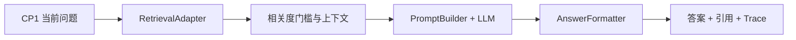
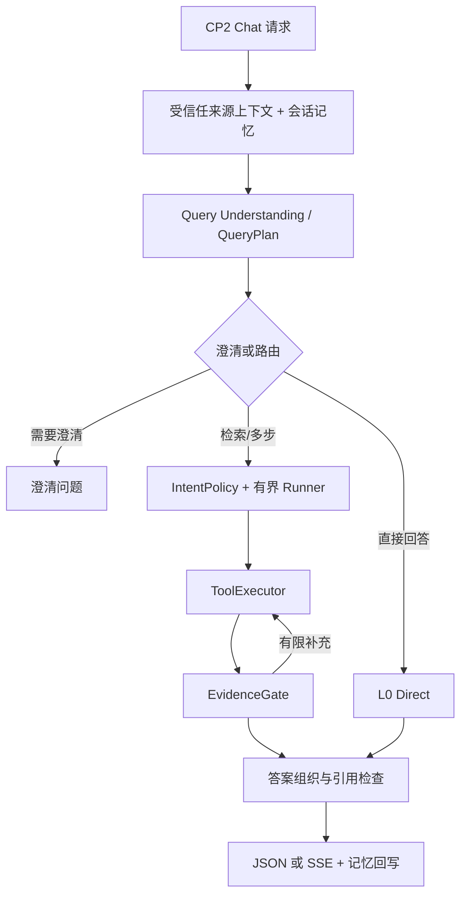
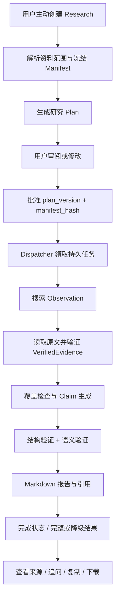

# Agent CP2 完整版本说明与使用指南

| 项目 | 说明 |
| --- | --- |
| 项目 | AI-QA-Assistant |
| 说明对象 | Agent 层 CP2：有界多步问答、Local Deep Research 及 Web 接入 |
| 编制日期 | 2026-10-09 |
| 版本基线 | `agent-dev-infra` 当前工作副本，含尚未提交的版本内容；不是仅以 Git HEAD 标识的发布包 |
| CP1 对照依据 | 仓库 CP1/CP2 架构资料中的单轮 RAG 基线 |
| 测试依据 | 英文冻结主集、108 个验收坐标、质量评分和人工复核记录、Agent 回归及前端验证记录 |
| 文档范围 | 功能、设计、接口、技术栈、测试能力、准确度、性能与操作流程；不包含问题修复过程 |

## 1. 版本定位

CP2 将 CP1 的“检索一次后生成答案”扩展为两条独立链路：

1. **Chat**：使用会话上下文理解问题，形成 QueryPlan，按意图和来源范围执行有预算的检索与工具调用，检查证据并输出带引用的答案。Fast 模式提供较直接的检索问答路径。
2. **Local Deep Research**：用户主动创建任务，审阅研究计划和资料清单，批准明确的计划版本后，系统执行检索、原文读取、覆盖检查、声明验证和报告生成。任务、计划、证据和进度持久化保存。

Chat 不会因为问题复杂而自动创建 Research Job。Deep Research 的计划批准是独立产品步骤，研究任务不能被理解为无限制的网络搜索代理。

本版本优先使用英文资料和英文问题进行质量验收。Research 的报告语言默认 `en-US`；Chat 应按问题及上层语言要求作答，英文主集的正文全部满足英文要求。这不代表所有任意语言输入都被强制转换为英文。

### 1.1 能力状态

| 状态 | 能力 |
| --- | --- |
| 已实现并有本次主要验收证据 | 英文 Fast 问答、手动研究任务、计划审阅/修改/批准、限定资料检索、原文证据验证、结构化研究报告、引用与来源查看、研究追问、报告下载、跨刷新保存 |
| 已实现，有代码和本地回归覆盖 | 有界 AgentRunner、意图策略、会话改写/澄清、工具超时和预算、纠正检索、任务恢复、进度事件、内部 Memory DTO、来源上下文隔离 |
| 可选能力，依配置启用 | 统一查询准备、级联/混合意图路由、知识导航与探索、Wiki 工具、持久记忆接入、阶段专用模型 |
| 不纳入本轮完成声明 | G3 PageIndex 在线组、完整 Skills System、任意网页研究、多用户生产容量、生产 SLA、所有 Topics 数据操作 |

“代码存在”“开关已开启”“有在线验收记录”是三个不同条件。本文件不会将可选组件统一描述为默认上线能力。

## 2. CP1 与 CP2 对比

### 2.1 功能和能力

| 维度 | CP1 基线 | CP2 当前设计与实现 |
| --- | --- | --- |
| 问题处理 | 以当前问题进行单轮检索 | 会话引用解析、独立问题改写、意图判定、歧义澄清、子查询与范围规划 |
| 中间表示 | 检索参数与上下文 | 严格结构化 QueryPlan、IntentPolicy、来源意图、研究 Plan 和 SourceManifest |
| 路由 | 固定检索→生成 | Chat L0 直接、L1 检索、L2 有界多步；Research 独立入口 |
| 记忆 | 不以多轮上下文编排为核心 | 进程内 ConversationMemory；另提供受信任 Web 接入的持久 Memory 契约 |
| 工具调用 | RetrievalAdapter 单轮调用 | 动态工具注册、策略限制、工具执行器、重复调用限制、预算与超时 |
| 检索策略 | 一次检索与分数门槛 | 证据质量门控、有限纠正检索、子查询处理；导航/探索为可选扩展 |
| 来源范围 | 检索过滤条件 | 企业知识库、个人资料、会话附件来源意图；实际授权由服务端上下文控制 |
| 研究能力 | 无独立持久化研究任务 | 人工启动、计划批准、任务依赖、搜索与原文读取、覆盖评估、声明验证、报告 |
| 证据对象 | 检索片段和引用 | 明确区分 Observation、VerifiedEvidence、Claim、Verification 和 Citation |
| 冲突与未知 | 主要依靠生成提示 | 范围、时间、版本、冲突及缺失覆盖进入报告处理；允许保守回答或澄清 |
| 状态保存 | 请求级结果和 Trace | Chat Trace；研究 Job/Plan/Manifest/报告/事件 SQLite 保存，另有执行检查点 |
| 输出 | JSON 答案与引用 | JSON 答案、独立 SSE 接口、研究进度/事件/Markdown 报告与来源接口 |
| 验收 | 基础单元/接口与检索问答验证 | 英文冻结集、G1/G2 重复评测、六层检查、六维评分、争议人工复核、前端链路验证 |

本轮 G1 是 **CP2 当前 Chat 接口的 `fast_chat` 基准组**，不是部署 CP1 的对照实验。运行器请求未显式发送 `weight_mode=fast`，而当前请求 schema 默认是 `thinking`；因此组名不能证明每份历史记录都走了前端 Fast 专用路径。G1/G2 数据不能用于宣称“CP2 比 CP1 准确率提高多少”或“提速多少”。

### 2.2 运行链路







### 2.3 技术栈

| 层 | CP1 基线 | CP2 当前技术栈及用途 |
| --- | --- | --- |
| 语言与 API | Python、FastAPI、Uvicorn、Pydantic | 沿用；增加更严格的计划、任务、证据、记忆和进度 DTO |
| 模型接入 | OpenAI-compatible HTTP | 沿用兼容接口；可分别指定查询准备、快速答案、完整性审阅阶段模型 |
| Chat 编排 | ChatService / Adapter / Prompt / Formatter | Orchestrator、IntentPolicy、AgentRunner、ToolExecutor、EvidenceGate |
| Research 编排 | 无独立图运行时 | LangGraph、SQLite Checkpointer、持久化 Repository 与周期 Dispatcher |
| 检索 | Tool Layer 的 vector / bm25 / hybrid | Chat 继续通过 Tool Layer；当前 Local Research 默认采用 JSON 文档目录的有界词法检索适配器 |
| 数据持久化 | 主要请求结果/Trace | Research SQLite 业务库与检查点；Web 使用 libSQL/SQLite、Drizzle 保存应用数据 |
| 用户界面接入 | 问答界面 | Vue 3、Vite、Nitro 服务端接入、TypeScript、Nuxt UI、Tailwind；不将前端栈算作 Agent 自身依赖 |
| 测试 | pytest 与 Mock | pytest、英文基准运行器、评测记录转换/评分、Vitest、浏览器功能验证 |

`agent/requirements-week1.txt` 提供当前固定安装版本：FastAPI 0.139.0、Uvicorn 0.41.0、Pydantic 2.13.4、httpx 0.28.1、pytest 9.1.1、LangGraph 1.2.11、langgraph-checkpoint 4.2.0、langgraph-checkpoint-sqlite 3.1.1。这是依赖文件的版本，不是跨设备环境自动一致的保证。

Milvus、向量模型与文档入库属于配套 Tool/Data 层。Agent 不自行实现向量数据库，也不能把 Local Research 的 `semantic_search` 工具名称等同于当前默认适配器已经使用向量语义检索。代码中的 `LocalJsonSearchBackend` 明确实现词法发现与片段排序。

## 3. Chat 新增模块完整说明

### 3.1 会话记忆与受信任上下文

**设计目的**：理解追问、省略主语和前文引用，同时避免浏览器伪造用户记忆或资料授权。

| 项目 | 说明 |
| --- | --- |
| 输入 | session_id、当前问题、已有会话；内部接入另有 authenticated actor、chat revision、Snapshot、Facts、Tail |
| 处理 | 整理有限历史，解析前文引用；内部持久记忆路径校验版本、顺序、重复消息与有效事实 |
| 输出 | 模型历史、Memory Brief、上下文元数据或内部 MemoryDecision |
| 技术 | Python 数据模型、进程内 ConversationMemory；持久记忆由 Web 保存、Agent 消费受信任 DTO |
| 交互 | 在同一会话追问；改变会话或清空历史时，上层应正确维护上下文与 revision |
| 边界 | 进程内记忆不具备跨重启/跨 worker 一致性；持久记忆开关默认关闭，不能仅靠 session_id 宣称已持久化 |

公共 `ChatRequest` 拒绝 `memory_context`、`personal_library_context`、`attachment_context`。内部接口使用独立模型和 `X-Agent-Internal-Token`；内部决策不能原样透传浏览器。

持久 Memory 支持 GOAL、PREFERENCE、PLAN_CONSTRAINT 类型事实。压缩计划是纯计算计划，由 Web 在消息持久化后原子应用，Agent 不在该步骤直接写 Web 数据库。Memory Cache 当前不作为支持能力。

### 3.2 Query Understanding 与 QueryPlan

**设计目的**：在检索之前确定“问什么、是否需要澄清、搜哪些来源、是否拆分”。

主要输入是当前问题、会话历史与允许的上下文；主要输出是 `QueryPlan`：

| 字段组 | 内容与用途 |
| --- | --- |
| 问题 | original_query、standalone_query |
| 意图 | intent、intent_confidence；支持 knowledge_qa、document_search、summarization、comparison、casual_chat、system_help、unsupported |
| 会话判断 | is_follow_up、is_clarification_reply |
| 澄清 | needs_clarification、clarification_question、ambiguity_reason |
| 检索范围 | filters、source_intent、scope、navigation_mode |
| 多步提示 | sub_queries、needs_structure、needs_knowledge、needs_version_reasoning |

统一查询准备路径可在一次模型调用内组合改写、规划和澄清，解析结构化输出并限制子问题数量；这是配置可选路径，不代表每次请求必走同一种路由。实际 Fast 检索路径最多取前 4 个子查询。

“latest architecture”缺乏时间或模块范围时，系统可以先澄清；明确日期、模块和授权来源后再检索。问题里的“我有权访问某文档”只能作为语义意图，不能扩大服务端权限。

### 3.3 意图策略与有界 AgentRunner

**设计目的**：让复杂问答能够调用工具，同时保留调用边界、停止条件和明确状态。

- `IntentPolicy` 将意图映射为允许工具、检索/调用预算、回答与引用要求。
- `ToolsetRegistry` 从现有 Toolset 暴露动态工具 schema，不维护第二套独立工具映射。
- `ToolExecutor` 控制并发工作线程、等待任务数及单次工具超时。
- Runner 限制迭代和重复调用；无法获得新证据、预算耗尽或工具失败时结束，而不是无限循环。
- Chat 路由分为直接、检索和有界多步，均不会隐式进入 Research。

配置默认值包括 `MAX_AGENT_ITERATIONS=5`、`MAX_REPEATED_TOOL_CALLS=2`、`TOOL_TIMEOUT_MS=60000`、执行线程上限 8、待执行任务上限 16。实际环境可覆盖默认值；这些上限不是每次必定消耗的次数。

输入：QueryPlan、策略、历史、工具 schemas、授权来源范围。输出：执行结果、证据集合、停止状态与 Trace。典型状态包括 `success`、`clarification_required`、`agent_limit_reached`、`tool_error`、`no_relevant_context`、`retrieval_error`、`llm_error` 和 `quality_validation_failed`。

### 3.4 证据门控、纠正检索与答案输出

**设计目的**：把“搜到结果”与“足以回答”分开处理，并使答案引用可核对。

EvidenceGate 检查候选上下文质量；不足时允许受限制的纠正检索。常规 Chat 契约中的纠正检索最多一次，不是无限搜索。答案阶段组织事实、计算和综合信息，并检查引用编号及来源一致性。复杂答案可使用专用完整性审阅模型；具体是否调用取决于配置和路径。

`ChatResponse` 输出 `trace_id`、`status`、`answer`、`message`、`citations` 和可选 `chat_title`。Citation 可以含文档、片段、URL、snippet、来源类型、证据 ID、locator 与版本信息。

引用编号合法只说明结构正确，不自动证明每个事实正确；内容仍需对照对应原文。回答未知、拒绝无依据的精确数字或提出澄清，均属于正常能力。

### 3.5 SSE 与前端交互

当前存在独立 `POST /api/chat/stream` SSE 接口。普通 `POST /api/chat` 仍是 JSON 契约；不要仅给 JSON 接口添加 `stream:true` 就假定获得 SSE。部分早期文档中“SSE 预留”的描述不代表当前代码状态。

Web 负责提交问题、展示流式答案与执行步骤、保存消息和引用。实时过程可折叠，折叠后展示当前步骤；展开后展示完整过程，并在滚动时保持可见。来源弹窗用于查看证据片段和原文入口。主题遵循应用 System/Light/Dark 设置。

本轮实际验证包括英文 Fast 提交、来源查看、长答案复制、编辑/重新生成、刷新保存及研究追问。主题验证覆盖主要页面显示；不扩展为所有设备和所有数据状态的完整 UI 验收声明。

### 3.6 可选导航、探索与辅助功能

知识导航可使用 direct/hierarchical/hybrid 范围决策；探索有独立回合、工具调用和证据条数预算。默认 `AGENTIC_EXPLORATION_ENABLED=false`、`KNOWLEDGE_NAVIGATION_ENABLED=false`。探索配置默认最多 4 回合、8 次工具调用、20 条证据。

Wiki 相关工具包括 `wiki_search`、`wiki_read_page`、`wiki_read_sources`、`wiki_search_evidence`，需对应提供者和工具注册可用。不能将其视为任意外网搜索能力。

Topic 摘要接口生成 title、description、soul_content 和 tags，用于上层主题组织。它属于辅助交互能力，本轮未完整验证所有真实 Topic 数据操作。

## 4. Local Deep Research 新增模块完整说明

### 4.1 控制面与批准边界

用户选择资料并提出研究问题；系统解析来源后创建 Job 和计划。用户可修改目标、任务和报告要求，然后批准最新计划。

批准输入必须包含 **当前 `plan_version` 和 `manifest_hash`**。计划变更后旧批准不能被当作新计划批准。计划修订不能借修改任务扩大已冻结的来源范围。

| 对象 | 输入/主要内容 | 输出/用途 |
| --- | --- | --- |
| ResearchRequest | query、source_scope、report_spec、profile、user_notes | 创建研究任务 |
| SourceScope | knowledge_base_ids、document_ids、topic | 解析可访问资料范围 |
| SourceManifest | 文档 ID、标题、URL、版本/时间、authority、content hash、manifest hash | 冻结研究资料快照，供执行和批准核对 |
| ResearchPlan | objective、out_of_scope、tasks、budget、report_spec、version、manifest_hash | 可审阅执行计划 |
| PlanRevision | base_version、目标/任务/报告要求、revision_note | 新计划版本 |
| Approval | plan_version、manifest_hash | 进入可执行状态 |

请求 schema 拒绝未知字段。问题长度为 1–4000 字符；source_scope 最多 100 个 document_ids、20 个 knowledge_base_ids；当前 profile 为 `standard`。

### 4.2 研究计划和预算

每个任务包含问题、目的、依赖、允许工具、资料 ID、验收标准、优先级和行动预算。任务状态有 pending、ready、running、succeeded、failed、blocked，优先级有 critical、normal、optional。

默认研究预算：最多 8 个任务、32 次行动、32 次工具调用、20000 token 预算字段、300 秒；单任务默认最多 4 次行动。预算字段用于约束执行，不可理解为所有模型服务均能提供精确、统一的实测 token 计费统计。

计划器可以使用兼容模型生成结构化计划，随后经代码校验。计划是可执行数据，不是随意展示的文字大纲。

### 4.3 搜索发现与原文读取

当前 Local Research 工具白名单：

| 工具 | 输入 | 输出及用途 |
| --- | --- | --- |
| list_documents | 已冻结范围 | 可用文档与元信息 |
| get_document_outline | doc_id | 文档结构/目录 |
| keyword_search | query、范围、top_k | 候选片段 Observation |
| semantic_search | query、范围、top_k | 搜索适配器的候选结果；默认本地实现仍为词法发现 |
| read_document_range | doc_id、原文定位范围 | 可验证原文，用于建立 VerifiedEvidence |

默认 `from_local_catalog` 组合使用 JSON 文档目录、LocalDocumentResolver 和 LocalJsonSearchBackend。搜索按片段排序，考虑词频和标题重复因素，并在多个文档之间分配候选结果。

**Search 返回值不能直接作为已验证事实。** 原文读取必须通过文档白名单、版本/内容 hash 和 locator 等检查，才形成 VerifiedEvidence。证据记录包含 research_id、task_id、doc_id、doc_version、locator、excerpt 和 content_hash。

### 4.4 覆盖、声明与验证

执行流水线依次处理：

1. 根据任务和候选结果读取原文，形成证据。
2. 将证据与任务验收标准关联，记录 covered/missing 与 sufficient。
3. 生成带 evidence_ids 和 criterion_ids 的 ClaimDraft。
4. 结构验证检查引用关联、对象及范围。
5. 语义验证检查声明与证据关系。
6. 由通过检查的内容渲染报告，保留缺失或冲突的边界。

当前默认语义验证器为 `DeterministicSemanticVerifier`。报告生成可使用 `EvidenceReportSynthesizer` 连接模型。不要将生产管线的确定性验证器和测试阶段的模型质量评审混为同一个组件，也不要声称模型事实验证完全取代了代码验证。

### 4.5 报告、引用与追问

ReportSpec 默认 Markdown、`en-US`、启用引用和限制说明，可指定标题、章节和报告要求。ResearchReport 输出正文、complete/degraded、claims、evidence、citations、conflicts 和 limitations。

Citation 携带证据关联、文档/版本信息、locator、excerpt 与 hash；来源接口提供本地原文核对入口。报告中的数字比较应区分项目去重提交数与模块提交数，不能通过简单相加伪造项目唯一总数。

报告可复制、下载 Markdown、展开原文并继续英文追问。追问可围绕已完成报告作说明、计算或定位证据；需要改变批准资料范围或重新开展研究时，应新建/重新明确研究任务，而不是默默扩大旧任务权限。

`include_limitations` 当前默认开启。系统允许表达证据不足和未知；“证据充分时自动隐藏整个 Limitations and uncertainty 章节”不作为本说明确认的已交付行为。

### 4.6 持久运行、恢复与进度

SQLite Repository 保存业务真相：Job、Manifest、Plan、批准、任务、证据、声明和报告。LangGraph Checkpointer 保存恢复需要的执行标识和阶段；不把完整报告只存入图状态。

LangGraph 主阶段：`prepare → execute_tasks → coverage → generate_claims → structural_verification → semantic_verification → render_report → finalize`。

应用中的周期 Dispatcher 扫描持久任务，通过原子领取避免同一 READY 任务重复执行；对已有执行状态尝试恢复。默认扫描间隔 2 秒，在后台异步任务中通过线程执行同步运行时；不是额外独立队列产品。

状态链路：`created → planning → awaiting_approval → ready → researching → synthesizing → completed`，另有 `failed`、`cancelled` 终态。Job 的 `completed` 表示执行结束，Report 的 `complete/degraded` 表示覆盖质量，两者不能混用。

Progress 提供阶段、任务完成数、百分比与 elapsed_ms、actions/tool_calls、文档读取、证据接受/拒绝、重试和恢复等指标。Events 支持 cursor 和有限批次拉取，用于前端过程展示。evaluation-trace 提供真实执行产物用于评测，不能从最终引用反向伪造执行轨迹。

## 5. 接口与模块地图

### 5.1 HTTP 接口

| 接口 | 功能 | 主要输入/输出 |
| --- | --- | --- |
| GET /health | 进程健康 | status |
| GET /ready | 容器及检索/意图初始化状态 | ready/degraded 与详细状态 |
| POST /api/chat | JSON Chat | ChatRequest → ChatResponse |
| POST /api/chat/stream | SSE Chat | ChatRequest → 流式事件 |
| GET /api/chat/history | 会话历史 | 按实际接口查询参数读取历史 |
| GET /api/tools | 可用工具 | 当前工具注册信息 |
| POST /api/research/jobs | 创建研究 | ResearchRequest → Job，201 |
| GET /api/research/jobs/{id} | 任务状态 | Job |
| GET /api/research/jobs/{id}/plan | 当前计划 | ResearchPlan |
| POST /api/research/jobs/{id}/plan/revisions | 修改计划 | PlanRevision → 新计划 |
| POST /api/research/jobs/{id}/approve | 批准版本/资料快照 | Approval → Job |
| POST /api/research/jobs/{id}/cancel | 取消任务 | Job |
| GET /api/research/jobs/{id}/progress | 进度 | ResearchProgress |
| GET /api/research/jobs/{id}/events | 事件 | 事件批次与游标 |
| GET /api/research/jobs/{id}/report | 报告 | ResearchReport |
| GET /api/research/jobs/{id}/evaluation-trace | 评测轨迹 | 实际搜索、证据、声明、验证产物 |
| GET /api/research/jobs/{id}/documents/{doc_id}/source | 原文 | 受研究资料范围限定的本地内容 |
| POST /api/research/jobs/{id}/messages | 研究交互/追问 | message → action/message/job/可选 plan |

Chat 接口校验 Agent 共享 Bearer key，内部 Memory 接口另校验内部 token。当前 Research 路由按用户上下文维护任务归属，但路由本身没有统一绑定 Chat 的 `verify_agent_key` 依赖；不能仅依据早期 API 文档写成“所有 `/api/*` 均已统一鉴权”。本地开发应只监听回环地址，远程部署需统一可信入口与身份传递，不能直接暴露研究端口让调用者任意声明用户身份。

### 5.2 代码地图

| 模块 | 位置 | 主要职责 |
| --- | --- | --- |
| 应用与生命周期 | `agent/app.py` | 容器初始化、路由、研究 Dispatcher 启停 |
| 配置 | `agent/agent/config/settings.py` | Agent .env、模型和功能开关 |
| Chat DTO | `agent/agent/schemas/chat.py` | 公共/内部请求、答案、引用、Memory 契约 |
| QueryPlan | `agent/agent/schemas/query_plan.py` | 问题与来源意图的严格中间模型 |
| 查询准备 | `agent/agent/query/preparation.py` | 改写、澄清、拆分与结构化准备 |
| Chat 编排 | `agent/agent/orchestration/orchestrator.py` | 上下文、策略与执行组合 |
| 快速/流式接入 | `agent/agent/agent.py` | Fast 检索、答案与流式实现 |
| 动态工具 | `agent/agent/tools/registry.py` | 复用 Toolset schema |
| Research 契约 | `agent/agent/schemas/research.py` | 请求、计划、证据、报告、进度与状态 |
| Research 控制面 | `agent/agent/api/research_routes.py` | 创建、修改、批准、取消、报告与追问接口 |
| Research 业务层 | `agent/deep_research/service.py` | 计划与批准规则 |
| 资料范围 | `agent/deep_research/manifest.py` | 本地资料解析与冻结 |
| 检索/原文 | `agent/deep_research/tools.py` | Manifest 范围内搜索及读取 |
| 持久化 | `agent/deep_research/repository.py` | SQLite 业务状态 |
| 执行装配 | `agent/deep_research/execution.py` | Resolver、工具、Worker、模型报告、Checkpointer 组合 |
| 图运行时 | `agent/deep_research/runtime.py` | LangGraph 阶段与恢复 |
| 执行流水线 | `agent/deep_research/pipeline.py` | 证据、覆盖、声明、验证、渲染 |
| 验证 | `agent/deep_research/verifier.py` | 声明/证据语义关系检查 |
| 后台调度 | `agent/deep_research/dispatcher.py` | 扫描、领取、继续执行 |
| 在线基准 | `agent/eval/deep_research_benchmark.py` | 创建真实运行、保存记录和计时 |

## 6. 测试集、评测流程与评审方法

### 6.1 数据集和实验分组

英文冻结主集为 `eval/deep_research_a/datasets/cases.en.v1.json`，共 18 题。每题固定问题、允许资料、预期关键事实和禁止使用的范围，Manifest 固定资料版本/URL/hash。不能运行中替换资料后仍声称是相同冻结实验。

| 组 | 实现 | 本轮规模 |
| --- | --- | --- |
| G1 / fast_chat | CP2 Chat 基准组；组名不等于已强制 Fast 权重 | 18 题 × 3 次 = 54 |
| G2 / deep_research_current | 当前 Local Deep Research | 18 题 × 3 次 = 54 |
| G3 / page_index | 需要真实 PageIndex provider | 未执行，不计入完成率 |

主集共 108 个独立 `case_id/group/repetition` 坐标。验收账本保留所选记录的来源及原始评分，不把同坐标的重复运行累计成更多样本。另有日期/范围变体、前端交互与本地回归，单列说明，不混入 108 的分母。

### 6.2 十八题覆盖

| 用例 | 主要能力检查 |
| --- | --- |
| DR-A-001 | W30/W34 Agent 数量分类、跨期比较与差值 |
| DR-A-002 | Master 与 Agent/Web 统计，Standby；避免模块相加冒充项目去重提交数 |
| DR-A-003 | Query Rewriter、Clarification、Intent 交付提交与 Python 文件 |
| DR-A-004 | 知识库三级目录、Agent 演进归档、模块根与 lifetime |
| DR-A-005 | 早期依赖与后期演示的时间演进，区分真正矛盾与阶段变化 |
| DR-A-006 | 完整 Skills System、Registry 目标与记录状态区别 |
| DR-A-007 | 无 SLA/事故数证据时拒绝编造生产指标 |
| DR-A-008 | latest architecture 的时间/范围歧义处理 |
| DR-A-009 | W28/W30/W34 Master 统计及相邻/跨期算术 |
| DR-A-010 | 联合验收条件与算术判断 |
| DR-A-011 | Delivered/Standby 表读取与项目统计口径 |
| DR-A-012 | 指定 CP2 目标、重复编号下的名称区分、空白状态不推断 |
| DR-A-013 | 提交身份、日期、原始来源链接与具体 locator |
| DR-A-014 | 模块/周期限定，排除相似但无关资料 |
| DR-A-015 | 仅 W33 授权下的可回答范围 |
| DR-A-016 | 禁止使用授权范围外的 W34 Web 精确数字 |
| DR-A-017 | 跨模块生命周期、各周统计与峰值 |
| DR-A-018 | Deep Research 演示能力、记录边界与评测优先级综合 |

### 6.3 评测与评审流水线


六层检查分别为 Plan、Retrieval、Evidence、Report、Citation、Runtime：检查计划和资料范围、实际检索观察、原文证据、报告事实和覆盖、引用关联、运行终态/预算/恢复等。确定性硬门槛优先，模型高分不能覆盖范围越界或非法证据等失败。

模型评审输入为问题、冻结资料片段和候选答案，不允许以外部知识补足候选答案。六维各 1–5 分：correctness、completeness、faithfulness、answer_relevance、limitation_disclosure、conflict_handling。

原始严格质量通过定义：**六维均至少 4 分，且没有 unsupported_claim_ids 标记**。不存在必要限制或冲突时，相应维度可以为 5 分，不要求每份答案为评分额外添加免责声明。正确拒答、澄清应按该题预期判断。

争议人工复核重新核对题意、事实、资料日期、名称/编号和引用。复核结论单独保存，不把原始评分改为满分，也不删除原 unsupported 标记。部分争议涉及历史资料不能证明后续生产状态，以及重复目标编号的名称区分。

## 7. 完整测试后的能力与准确度

### 7.1 主集结果

| 指标 | 结果 | 含义 |
| --- | --- | --- |
| 独立验收坐标 | 108/108 | 覆盖两个组的全部 18 题、各 3 次 |
| 最终所选记录接口成功 | 108/108，100% | 技术执行成功，不等于事实准确率 |
| 有效质量评审 | 108/108 | 六维评分完整有效 |
| 原始严格质量通过 | 98/108，90.74% | 保留原模型评审结果 |
| G1 原始严格通过 | 50/54，92.59% | fast_chat 基准组 |
| G2 原始严格通过 | 48/54，88.89% | Local Research |
| 争议人工复核 | 10/10 通过 | 额外复核结论，不能替代原始通过率 |
| 复核后的本冻结集验收 | 108/108 | 仅适用于本集、所选记录及既定判定方式 |
| 来源范围越界 | 0 | 冻结资料权限范围检查 |
| 非法引用编号 | 0 | 引用结构检查 |
| 非英文正文 | 0 | 本轮语言要求检查 |
| G2 本地原文访问 | 228/228 成功 | 不代表外部 Confluence 登录可达性 |
| G2 结果状态 | 39 complete、15 degraded | 执行完成与覆盖质量分别记录 |

不能将 108/108 复核验收写成“系统任意问题准确率 100%”。本集是项目资料领域内的小规模冻结评测，包含需要拒答/澄清的题目；不提供跨领域统计估计，也没有独立 CP1 同配置实验。

### 7.2 六维平均分

| 维度，满分 5 | G1，54 次 | G2，54 次 |
| --- | --- | --- |
| correctness | 4.963 | 5.000 |
| completeness | 4.852 | 4.852 |
| faithfulness | 4.944 | 4.889 |
| answer_relevance | 4.907 | 4.907 |
| limitation_disclosure | 5.000 | 4.981 |
| conflict_handling | 4.944 | 5.000 |

平均分来自原始评审，不是人工复核后重算的分数；平均分较高仍可能存在某份答案未过严格门槛。

### 7.3 已验证能力边界

- 支持英文数量提取、表格理解、跨期计算、模块区分与多资料综合。
- 对“计划”“记录状态”“演示”“生产状态”作证据范围区分；资料不足时保持未知。
- 在指定资料范围内提供引用、定位片段和可查看本地原文；本轮未发现范围越界。
- G2 支持完整和降级报告；降级是否合格必须结合题目判断，不能只看状态。
- 已验证从前端选择资料、研究计划操作、执行、报告、原文查看、追问、复制、下载和刷新保存的主要链路。
- 结论不覆盖任意文档格式、外网可达性、所有附件/个人库权限组合、所有导航开关组合和生产并发容量。

### 7.4 本地与前端验证

| 验证 | 已记录结果 | 时间/范围 |
| --- | --- | --- |
| Agent 全量回归 | 771 passed，3 warnings | 2026-10-08；含单元和 Mock/集成场景 |
| 评测续跑工具 | 6 passed | 与全量覆盖存在重叠，不相加 |
| Frontend 全量 | 40 files、212 passed | 2026-10-08 保存结果 |
| 过程浮窗定向交互 | 2 passed | 2026-10-09 |
| 最新前端类型检查/生产构建 | 通过 | 2026-10-09 |
| 浏览器实测 | 主要 Chat/Research 链路通过 | 分阶段验证，非所有组合的自动化全矩阵 |

前端 212 项全量早于最后主题调整；不能把两项定向测试相加称为最新 214 项全量。Agent 测试数量和执行时间也不能当作在线模型性能。

## 8. 性能结果与计时口径

以下统计由验收账本引用的 108 个原始 RunEnvelope 的 `elapsed_ms` 逐项重算，P95 使用 nearest-rank，即排序后第 `ceil(0.95×N)` 项。

| 分组 | 样本数 | 平均，秒 | 中位数，秒 | P95，秒 | 最小，秒 | 最大，秒 |
| --- | --- | --- | --- | --- | --- | --- |
| G1 fast_chat 基准组 | 54 | 14.246 | 13.611 | 26.759 | 0.010 | 41.406 |
| G2 Local Research | 54 | 16.009 | 14.186 | 25.002 | 7.177 | 35.854 |

计时范围：G1 为基准客户端完成该次问答及引用 URL 检查的用例耗时；G2 包括创建任务、等待计划、自动批准、轮询完成、读取报告/进度/轨迹/事件及本地来源检查。模型质量评分不在此耗时内。G1 请求权重的上述边界同样适用于性能表，不能直接据此给前端 Fast 专用路径定性能指标。

G1 最短记录包含不需要完整模型生成的处理分支，不能当作正常生成答案只需 10 毫秒。G2 的评测脚本自动批准，不包含真实用户思考和手动修改计划的时间。

这批记录使用多份配置快照，不能解释为某个单一模型的统一性能基准。当前数字描述所选验收样本的实际耗时，不证明组间速度差异由架构单独造成。尚无本轮统一的首 token 延迟、tokens/s、并发 QPS、生产 P99 或 CP1 对照性能数据。

## 9. 使用新流程的完整指示

### 9.1 准备环境与数据

1. 使用 Python 3.11 环境，以及项目需要的 Node.js/pnpm。
2. 在仓库根目录安装根依赖；再安装 Agent 固定依赖，确保 LangGraph 和 SQLite Checkpointer 可用。
3. 配置 `agent/.env`，不要把真实凭证写入文档、代码或提交记录。
4. Chat 的 Tool Layer 需要可用文档索引、正确 embedding 维度及其数据库服务；有 Docker 不等于索引内容已经就绪。
5. Local Research 需要 `data-persistence/data/documents` 中有效 JSON 文档目录、可解析元信息及可写 SQLite 数据目录。
6. 如接 Web，配置 frontend 的 Agent 地址、共享 key、会话 secret 和数据库地址，并运行迁移/构建。

```powershell
# 仓库根目录：D:\htc_qa
python -m pip install -r requirements.txt
python -m pip install -r agent/requirements-week1.txt
```

Agent 最小配置示意（占位符必须替换；保留现有检索配置）：

```dotenv
LLM_API_KEY=<your-api-key>
LLM_API_BASE=<your-openai-compatible-base-url>
LLM_MODEL=<your-chat-model>
AGENT_API_KEY=<shared-agent-key>
RESEARCH_DOCUMENTS_DIR=D:/htc_qa/data-persistence/data/documents
RESEARCH_DATABASE_PATH=D:/htc_qa/data-persistence/data/research_jobs.db
RESEARCH_CHECKPOINT_PATH=D:/htc_qa/data-persistence/data/research_jobs.db.checkpoints
```

`agent/.env` 是 Agent 明确加载的配置文件。兼容模型需要支持当前链路使用的 system/user 消息、结构化计划要求和足够上下文；不可仅按接口名称判断适配。

可选开关按需开启。常规默认是 Query Understanding、Conversation Rewrite、Clarification、进程内 Memory 开启；Unified Query Preparation、探索、知识导航和 Persistent Memory 默认关闭。开启持久 Memory 前必须完成 Web 受信任上下文接入和内部 token 配置，不能只改一个开关。

Web 配置示意：

```dotenv
AGENT_BASE_URL=http://127.0.0.1:8010
AGENT_API_KEY=<same-shared-agent-key>
SESSION_SECRET=<your-session-secret>
TURSO_DATABASE_URL=file:.data/sqlite.db
```

本地当前常用 Agent 端口为 8010，前端为 3000；Agent 示例/默认端口也常见 8000。重点是 Web 和评测客户端地址与实际监听端口一致。

### 9.2 启动与就绪检查

在一个终端启动 Agent：

```powershell
Set-Location D:\htc_qa\agent
python -m uvicorn app:app --host 127.0.0.1 --port 8010
```

在另一个终端启动 Web：

```powershell
Set-Location D:\htc_qa\frontend
pnpm install
pnpm run dev -- --host 127.0.0.1 --port 3000
```

需要生产构建时在 frontend 执行 `pnpm run build`，该项目脚本同时包含数据库迁移和 Vite 构建。开发终端需要保持运行；停止监听进程后浏览器无法打开不属于答案质量结果。

检查顺序：

1. `http://127.0.0.1:8010/health` 返回 ok。
2. 查看 `/ready` 的 retrieval_ready 与 intent_ready；health 成功不代表检索已完成初始化。
3. 浏览器打开 `http://127.0.0.1:3000/`。
4. 确认资料列表包含要使用的文档，并先执行一条有确定来源的英文问题。

### 9.3 前端 Fast Chat

1. 创建或选择会话，选择 Fast 问答模式。
2. 明确问题的模块、时间和资料范围。例如：`Compare Agent deliveries in 2026-W30 and 2026-W34. Calculate the changes in total commits.`
3. 提交后查看执行步骤与答案；如收到澄清问题，补充日期/模块后继续。
4. 点击引用，核对文档标题、片段和具体数字；不要仅看最终状态。
5. 在同一会话追问，例如 `What is the absolute increase, and which sources support the calculation?`
6. 如需审阅计划、长期运行或明确多任务覆盖，主动进入 Deep Research，而不是期待 Chat 自动创建研究任务。

问题示例只在相应资料实际存在且已授权时适用；换成自己的文档时同步替换日期和模块。

### 9.4 前端 Deep Research

1. 进入 Deep Research，选择可访问资料；没有有效资料时先准备资料。
2. 输入研究问题，指定英文报告、目标章节和关注点。
3. 等待计划生成，审阅目标、排除范围、任务、依赖、工具和 SourceManifest。
4. 如任务遗漏或目标过宽，编辑并保存新计划版本；核对当前资料范围。
5. 批准当前计划版本和对应资料 hash。
6. 查看阶段、任务和证据进度；可折叠过程展示。需要停止时使用取消，不要以关页面替代取消任务。
7. 完成后分别查看 Job 状态和报告 complete/degraded；检查缺失标准与引用。
8. 展开来源核对原文，使用复制或 Markdown 下载取得报告。
9. 进行基于报告的追问；刷新后确认消息、报告和引用仍可读取。

### 9.5 直接调用 API 的本地示例

以下是可信本地调试示例；共享 key 从环境变量读取，不写明文。Research 示例中 `document_ids` 必须换成目录里真实、允许使用的 ID。

```powershell
$agentBase = 'http://127.0.0.1:8010'
$agentHeaders = @{ Authorization = "Bearer $env:AGENT_API_KEY" }

$chatBody = @{
  query = 'Compare Agent deliveries in W30 and W34, citing the evidence.'
  session_id = 'cp2-local-demo'
  top_k = 5
  retrieval_mode = 'hybrid'
  weight_mode = 'fast'
} | ConvertTo-Json -Depth 8
Invoke-RestMethod -Method Post -Uri "$agentBase/api/chat" `
  -Headers $agentHeaders -ContentType 'application/json' -Body $chatBody
```

创建和批准研究：

```powershell
$researchBody = @{
  query = 'Compare the two Agent sprint reports and calculate the changes.'
  source_scope = @{ document_ids = @('<actual-doc-id-1>', '<actual-doc-id-2>') }
  report_spec = @{ format = 'markdown'; language = 'en-US'; include_citations = $true; include_limitations = $true }
  profile = 'standard'
} | ConvertTo-Json -Depth 8
$job = Invoke-RestMethod -Method Post -Uri "$agentBase/api/research/jobs" `
  -Headers $agentHeaders -ContentType 'application/json' -Body $researchBody
$researchId = $job.research_id

# 等待 planning 结束；生产客户端应增加超时和错误展示。
do {
  Start-Sleep -Seconds 2
  $job = Invoke-RestMethod -Uri "$agentBase/api/research/jobs/$researchId" -Headers $agentHeaders
} while ($job.status -in @('created', 'planning'))
if ($job.status -ne 'awaiting_approval') { throw "Unexpected status: $($job.status)" }

$plan = Invoke-RestMethod -Uri "$agentBase/api/research/jobs/$researchId/plan" -Headers $agentHeaders
$plan | ConvertTo-Json -Depth 20
# 人工核对计划后执行下面的批准；使用刚读取的 version/hash。
$approval = @{ plan_version = $plan.version; manifest_hash = $plan.manifest_hash } | ConvertTo-Json
Invoke-RestMethod -Method Post -Uri "$agentBase/api/research/jobs/$researchId/approve" `
  -Headers $agentHeaders -ContentType 'application/json' -Body $approval
```

执行期间查询 `/progress` 和 `/events?after_event_id=0&limit=100`，后续事件请求使用返回游标。Job 为 completed 后读取 `/report`，失败时查看 error_code/failure_stage，取消时调用 `/cancel`。计划修订后重新读取 `/plan` 再批准，禁止沿用旧 version/hash。

SSE 客户端调用 `/api/chat/stream` 并正确解析事件、断开和终态；共享 key 由可信服务端持有，不在公开网页脚本里硬编码。

## 10. 复现实验与评审操作

在仓库根目录、配置好数据和 Agent 后执行：

```powershell
python eval/deep_research_a/suite.py validate
python eval/deep_research_a/suite.py preflight
python agent/eval/deep_research_benchmark.py run `
  --dataset eval/deep_research_a/datasets/cases.en.v1.json `
  --base-url http://127.0.0.1:8010 `
  --groups fast_chat deep_research_current --repetitions 3 `
  --output-dir outputs/cp2_acceptance_new
```

这会执行新的在线请求，不是只读取本次结果。默认三组的完整 A 阶段规格为 162 个坐标，但本版本完成声明明确是 G1/G2 的 108；没有 PageIndex provider 时不启用 G3，也不把本地词法搜索改名当作 G3。

基准输出需要转换为评测记录，再进行模型评审和硬门槛汇总：

```powershell
python eval/deep_research_a/convert_benchmark_runs.py <envelope-directory> --output-dir <record-directory>
python eval/deep_research_a/judge_records.py <record-directory> --output-dir <judgment-directory>
python eval/deep_research_a/suite.py score <run-record.json>
```

各工具的目录布局和批量参数以 `--help` 及评测 README 为准。批量评分默认完整性要求不能原样套用到只有两组的结果。评审需同时保留冻结资料、run envelope、转换记录、模型判断和人工复核，不能只保存最后的通过数字。

继续未完成实验时，运行器支持 `--completed-coordinates` 指定已完成坐标，以及 `--case-ids` 精确选择问题。保留旧记录 provenance，避免重复坐标和新旧资料版本混合。更改数据集/Manifest 必须创建新的实验版本。

## 11. 当前版本边界

1. 本轮完成的是 18 题、G1/G2、各 3 次的冻结集验收，不是大型跨领域基准。
2. 未建立 CP1 同配置在线对照；功能对比有代码和架构依据，准确度/性能提升百分比没有实验依据。
3. 默认 Local Research 是本地 JSON 资料研究；工具名不证明已经接入生产向量检索或 PageIndex。
4. 持久 Memory、知识导航/探索等可选路径需完整接入和对应验收，不能默认计入全部在线能力。
5. 原文检查验证本地来源；外部原始站点的认证和网络访问另行管理。
6. Research 的 degraded 需要结合覆盖情况阅读；系统不会将未知信息自动补成事实。
7. UI 与进程就绪、索引就绪、模型可用是不同条件；上线还需要部署级身份隔离和容量验证。
8. 仍保留当前报告的限制/未知表达机制，不宣称已实现按证据充分程度自动隐藏整章。

## 12. 核验资料

### 12.1 设计与契约

- [CP1/CP2 架构对照](../cp1_cp2_architecture_overview.md)
- [Agent README](../../README.md)
- [接口契约](../interface_contract.md)
- [API 契约](../API_CONTRACT.md)（部分历史描述以当前代码为准）
- [Research 合约](research_contract_v1.md)（早期规范；当前 schema 以代码为准）
- [研究运行时说明](day3_day4_runtime.md)
- [Chat 路由策略](chat_route_policy.md)
- [Research 当前 schema](../../agent/schemas/research.py)
- [Chat 当前 schema](../../agent/schemas/chat.py)
- [Agent 配置默认值](../../agent/config/settings.py)

### 12.2 测试与统计证据

- [英文评测集](../../../eval/deep_research_a/datasets/cases.en.v1.json)
- [评测说明](../../../eval/deep_research_a/README.md)
- [评审提示词目录](../../../eval/deep_research_a/prompts)
- [基准运行器](../../eval/deep_research_benchmark.py)
- [验收汇总](../../../outputs/quality_repairs_qwen36_20261007/continuation_summary_20261008.json)
- [108 个坐标与评分账本](../../../outputs/quality_repairs_qwen36_20261007/continuation_ledger_20261008.json)
- [本说明重算的分组准确度/性能统计](../../../outputs/quality_repairs_qwen36_20261007/cp2_version_statistics_20261009.json)

`outputs/` 是本地测试产物目录，通常不随 Git 提交。向他人交付本说明时，需另外附带脱敏后的冻结资料、验收账本及运行记录，才能在另一台设备复核统计；本文件中已保留必要口径和主要数值。
