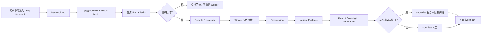

# CP2 Research Demo：政策版本冲突核验

## 演示目标

用同一个具体问题，让成员在 3—5 分钟内看清 CP2 核心链路与普通 Chat 的差别：普通 Chat 追求立即回答；Deep Research 先固定资料和计划，再执行可追溯的多步研究。

演示语料为虚构公司“星云科技”的脱敏示例，只用于稳定展示版本冲突，不构成真实差旅或财务规则。

## 演示问题

> 核验上海酒店 650 元/晚能否报销，比较正式办法和财务 FAQ 的 500 元、700 元住宿限额。员工出差日期为 2026 年 9 月 10 日，已取得直属经理审批。

## 冻结资料

| 文档 ID | 版本状态 | 关键事实 |
| --- | --- | --- |
| `demo-travel-policy-v1` | v1.0，适用至 2026-07-31 | 上海住宿限额 500 元/晚 |
| `demo-travel-policy-v2` | v2.0，2026-08-01 生效 | 上海住宿限额 700 元/晚；超过 600 元需直属经理审批 |
| `demo-travel-faq-legacy` | 2026-07-15 更新，待同步 | 页面仍写上海住宿限额 500 元/晚 |

## 现场操作

1. 首页进入 Deep Research，点击“一键载入演示案例”。
2. 指出三份来源的版本、日期和冲突数值，然后创建研究任务。
3. 在计划页不要立刻批准：先说明系统已持久化 `ResearchJob`、`SourceManifest`、`Plan` 和 `Task`，Worker 此时不能执行。
4. 展开三个有依赖关系的任务，核对 Manifest 哈希和计划版本，再点击批准。
5. 在执行页观察任务进度、证据数量和事件流。刷新页面，说明进度来自后端持久化状态，不是前端动画。
6. 在报告页查看结论、资料冲突、仍需确认事项和编号来源。

## 预期结果

- v2.0 对 2026-09-10 的差旅生效；650 元低于 700 元限额，且已满足“超过 600 元需直属经理审批”这一摘录中的条件。
- v1.0 与旧 FAQ 的 500 元口径和 v2.0 的 700 元口径冲突；旧 FAQ 更新时间早于 v2.0 生效日，正式办法说明应采用当前有效版本。
- 不能仅凭现有三份摘录断言最终一定报销成功，因为发票、预订渠道、差旅申请单等条件未提供。
- 页面显示“需要复核”是预期质量信号：研究链路发现并披露了资料冲突或边界，而不是执行失败。

## 一句话讲清价值

> 普通 Chat 给一个看起来合理的答案；CP2 Deep Research 给出“这个答案基于哪一版资料、经过哪些任务、引用了哪些原文、哪里存在冲突、还有什么不能确定”。

## 核心链路

