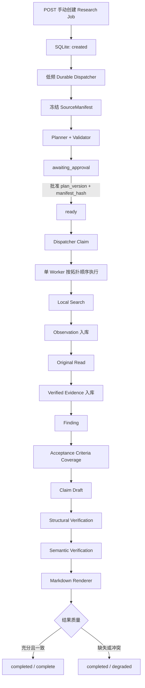

# CP2 Deep Research Core Vertical Slice 交付说明

## 交付结论

本周核心链路已经形成一个可运行、可持久、可追溯的 Local Deep Research
闭环。Research 只能由用户通过独立 API 手动启动，不会由普通 Chat
自动判断或触发；当前实现不访问 Web。



Repository 保存完整业务对象；LangGraph Checkpoint 仅保存阶段、计划版本、
尝试次数和实体 ID。Dispatcher 在重启后扫描 `created`、`planning`、
`ready`、`researching`、`synthesizing`，从安全检查点恢复；没有安全恢复点
时明确失败，不让 Job 永久停留在 running 状态。

## 场景测试设计与可见效果

| 场景 | 输入资料 | 核心断言 | 用户可见效果 |
| --- | --- | --- | --- |
| 手动 API 全链 | HTTP 创建、审批、查询报告 | 创建立即返回 created；两次 Dispatcher Scan 分别完成规划和执行 | 从真实 API 入口得到可定位 Markdown 报告 |
| Mock 完整链 | 一份固定部署记录 | 3 个任务均 Search、Read，Evidence 与 Claim 可反查 | Job 为 `completed / complete`，报告含 `[E:...]` 引用和证据索引 |
| 固定本地双文档 | Alpha、Beta 两份 JSON | 真实 Local Adapter 读取两个文档；两次运行报告完全一致 | 报告同时列出两个 `doc_id / line:x-y` 定位 |
| 资料不足 | 只有收入、没有利润 | Required Criterion 为 missing | Workflow 正常结束但为 `completed / degraded`，局限性明确写出缺失条件 |
| 证据冲突 | 预算分别为 100 万与 120 万 | Semantic Verification 为 `conflicting` | 报告显示“证据存在冲突”，不任选一方写成确定结论 |
| 创建后重启 | created Job | Dispatcher 重新发现 Job | Job 恢复到 `awaiting_approval`，不会丢失 |
| Manifest 落库后重启 | planning Job | 已冻结 Manifest Hash 保持不变 | 继续生成同一资料快照绑定的 Plan |
| Evidence 入库后重启 | 已有 Evidence、Job researching | 重放任务时 Evidence ID 幂等 | 最终完成且无重复 Evidence |
| Report 入库后重启 | 已有 Report、Job synthesizing | 恢复时复用 Report，只补 finalize | Job 转为 completed，Report 不重复 |
| 无安全检查点 | researching 但无 Checkpoint | Runtime 不猜测执行位置 | Job 明确转为 failed，不会永久 running |

固定资料位于 `mock/research_documents/`，测试入口为：

```powershell
python -m pytest -q tests/integration/test_research_vertical_slice_e2e.py
```

## 性能保护

- Dispatcher 默认每 2 秒进行一次有界扫描，不使用 busy polling。
- 扫描与 Research 执行通过后台线程运行，不占用 `/api/chat` 请求线程。
- Research Runtime 与 Chat Agent 生命周期分离；Chat 路径不会创建或审批 Job。
- SQLite 使用短事务、索引和 WAL；Repository 写入由进程内锁串行保护。
- 既有确定性 Chat 基线脚本继续作为 P95 回归门禁；接入后应保持相对稳定
  Mock Baseline 回归不超过 5%。

2026-08-30 在当前开发环境复跑 30 次确定性 Mock：Chat P95 为
`0.9450 ms`；仓库 Week 1 基线为 `2.0128 ms`，未出现回归。两次记录的
Python 补丁版本与 Windows Build 不同，因此该数字用于回归门禁，不代表生产
网络延迟。

## 本周边界

已刻意不实现 Web Research、并行 Worker、Replan、复杂多 Agent、SSE Replay、
Word/PDF 导出和通用 Skill Framework。下一阶段应先接入前端的创建／审批／轮询
页面，并用真实业务文档校准 Planner、语义验证器和检索质量。
