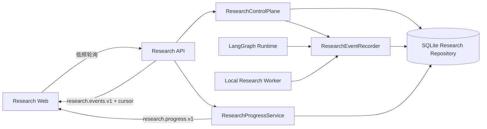

# CP2 Deep Research：A 侧本周交付

## 交付结论

A 侧已完成可持久化、可恢复、可供 Web 直接渲染的 Research Progress/Event
链路，并在 B 侧 PR #33 基线上完成真实接口接入。普通 Chat 路径保持不变。

## 核心链路



## A 侧完成项

- 冻结 12 个 Stage 的顺序、用户文案和百分比规则；
- 增加 `ResearchProgress`、Stage/Task Progress、Research Event 契约；
- 增加 `research_events` 表、索引、稳定 `event_key` 和增量游标查询；
- 在创建、规划、审批、取消、Runtime Stage、Worker Task、报告和终态接入事件；
- 聚合真实 Job、Task、Evidence、Claim 与 Event，未复制业务真相；
- 对 failed/cancelled/degraded/completed 建立明确读模型；
- 错误信息不暴露 Python 堆栈、绝对路径或底层敏感信息；
- 提供 `/api/research/jobs/{id}/progress` 和 `/events`；
- 提供 `mock/research_web_contract/` 共享 Fixture；
- Web 使用权威 Progress，事件按 `after_event_id` 增量拉取。

## 恢复和幂等策略

事件表对 `(research_id, event_key)` 建立唯一约束。Runtime 或 Worker 在重启后
重放同一阶段/任务时，重复事件写入会被安全忽略；Evidence、Finding、Claim 和
Report 继续沿用原有稳定实体 ID。Progress 是基于持久化实体的读模型，因此刷新
页面或重启 Agent 后无需依赖内存恢复 UI 状态。

## 验证结果

- 后端全量：371 tests passed；
- 新增契约/Repository/Progress/API 测试：7 tests passed；
- 前端本次变更定向 ESLint：0 errors；
- Vite Client Build：通过；
- 完整 Nitro Build 当前被仓库既有 Chat Server 导出错误阻断：
  `generateTopicTitle` 未从 `server/utils/soul.ts` 导出，与 Research 接入无关；
- 全仓 Typecheck 仍有既有 Chat/Server/自动导入声明问题，本次 Research 文件没有
  新增剩余类型错误。

## 演示路径

```text
手动打开 Deep Research
→ 创建 Job
→ 后台生成 Plan
→ 用户确认 Plan + Manifest 快照
→ Worker 执行本地资料研究
→ 页面显示权威 Timeline / Task / Evidence / Claim / Event
→ 输出 complete 或 degraded Markdown 报告
```
