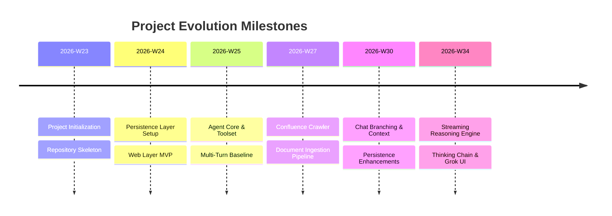

# Project Milestones & Delivery Roadmap

> **Project**: AI-QA-Assistant | **Documentation Platform**: Confluence
> **Historical Span**: 2026-06-05 to 2026-08-21 | **Total Sprints**: 11 Weeks

---

## 1. Project Overview & Timeline
The **AI-QA-Assistant** project is structured into 5 parallel engineering streams. Delivery is executed on a strict weekly cycle.

### High-Level Milestones

## 2. Weekly Sprint Roadmap Matrix
| Sprint Week | Date Range | Total Commits | Active Modules | Primary Focus & Milestone |
| :--- | :--- | :--- | :--- | :--- |
| **2026-W23** | 2026-06-05 ~ 2026-06-05 | 3 | `agent, infra` | Update Readme.md |
| **2026-W24** | 2026-06-09 ~ 2026-06-14 | 7 | `infra` | chore: merge remote main history |
| **2026-W25** | 2026-06-16 ~ 2026-06-21 | 21 | `agent, data-persistence, data-pipeline, infra, toolset, web` | Merge web repo into web/ subdirectory |
| **2026-W26** | 2026-06-22 ~ 2026-06-26 | 5 | `agent, infra, toolset, web` | Add web files from HTC-web |
| **2026-W27** | 2026-06-29 ~ 2026-07-05 | 35 | `agent, data-persistence, data-pipeline, infra, toolset, web` | chore: remove unused retrieval evaluation module |
| **2026-W28** | 2026-07-06 ~ 2026-07-10 | 9 | `agent, infra, web` | fix: display tooltip below badge and send full citation snippet from backend |
| **2026-W30** | 2026-07-20 ~ 2026-07-26 | 14 | `agent, data-persistence, data-pipeline, eval, infra, toolset, web` | feat(web): add observability dashboard, metrics endpoint, trace ID, and Web Vitals monitoring |
| **2026-W31** | 2026-07-27 ~ 2026-08-02 | 12 | `agent, data-pipeline, eval, infra, toolset` | feat(data-pipeline): add knowledge cards, precompressor, segmenter, and benchmark modules |
| **2026-W32** | 2026-08-03 ~ 2026-08-07 | 10 | `agent, data-persistence, data-pipeline, infra, toolset, web` | feat: complete topic management, dialogue branching, multi-turn chat, data persistence, and integrate remote dev |
| **2026-W33** | 2026-08-11 ~ 2026-08-11 | 1 | `agent, data-persistence, data-pipeline, eval, infra, toolset, web` | feat: add Hit Rate & Similarity monitoring drawer, optimize agent streaming resilience and UI navbar layout |
| **2026-W34** | 2026-08-18 ~ 2026-08-21 | 23 | `agent, web` | fix: template string expressions in ThinkingProcess.vue |
