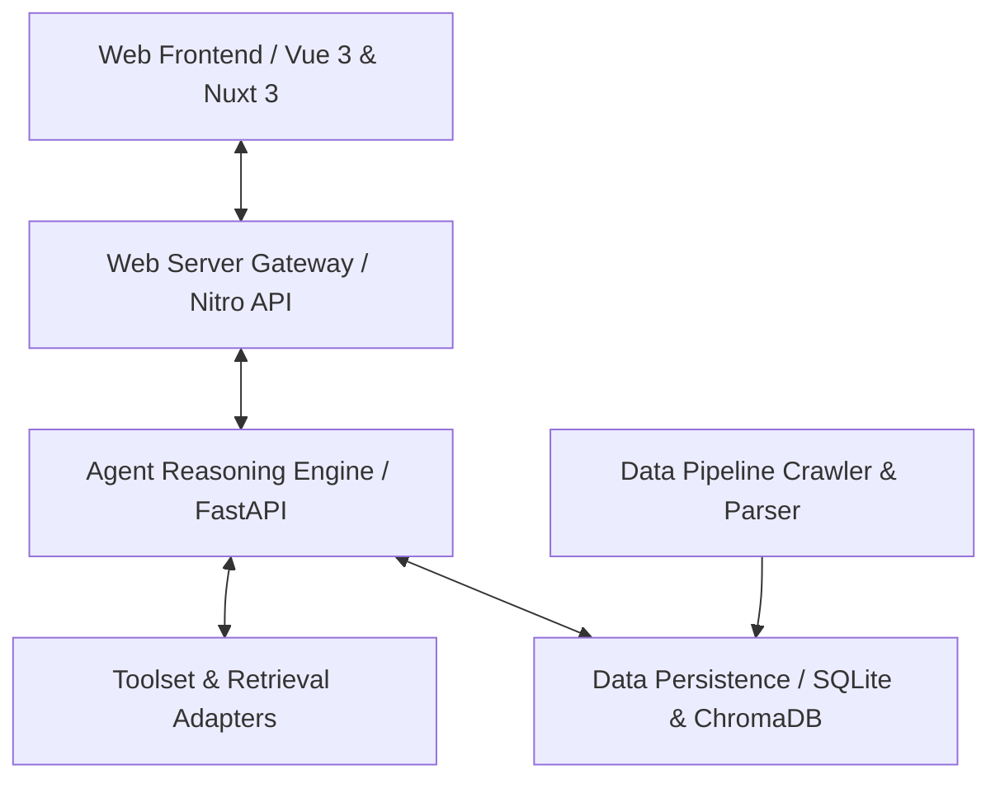

# System Architecture Evolution

> **System Overview**: End-to-End RAG & Agent Architecture Evolution

---

## 1. Multi-Tier Architecture Blueprint

## 2. Module Responsibilities
1. **`agent/` (Agent Module)**: Coordinates multi-turn dialogue, tool invocation planning, model integration (Qwen, DeepSeek, OpenAI), SSE streaming, and progressive reasoning tokens.
2. **`data-persistence/` (Persistence Module)**: SQLite-backed chat history, message branching, topic tracking, and vector embedding store connections.
3. **`data-pipeline/` (Pipeline Module)**: Crawlers for Confluence HTML, file attachment parsers, markdown splitters, and embedding indexing.
4. **`toolset/` (Toolset Module)**: Knowledge base retrieval tools, similarity search endpoints, and extensible plugins.
5. **`web/` (Web Frontend Module)**: Modern Vue 3 / Nuxt 3 user interface, real-time thinking process visualizer, source drawer, and document explorer.

## 3. Key Architecture Evolution Phases
- **Phase 1: Foundation (W23 - W24)**: Basic project skeleton, SQLite schema setup, and minimal web chat interface.
- **Phase 2: RAG Pipeline Integration (W25 - W28)**: Confluence document crawler, toolset adapters, and multi-turn prompt orchestration.
- **Phase 3: Topic Management & Branching (W30 - W32)**: Chat branching support, persistent message state, and improved API resilience.
- **Phase 4: Real-time Streaming & Reasoning UI (W33 - W34)**: Grok-style thinking trees, SSE token streaming, and hit-rate similarity telemetry.
